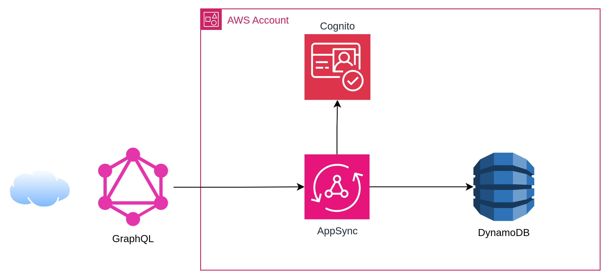

# API GraphQL: AWS AppSync + DynamoDB + Cognito



## Introducción

Cuando pensamos en construir una API en AWS, el patrón más común es **API Gateway → Lambda → DynamoDB**. Es sin duda mi manera preferida de crear una API, sin embargo tengo que reconocer que existen alternativas. ¿Y si pudiéramos eliminar esa Lambda del medio?

Cuando nos vemos en la tarea de proponer soluciones a nuestros clientes, al menos en mi humilde opinión, tener la posibilidad de implementar una POC de manera rápida para validar nuestros conceptos agrega una base sólida a nuestra propuesta. En esta POC exploramos **AWS AppSync** como alternativa para exponer una API GraphQL que se conecta **directamente a DynamoDB** usando resolvers VTL (Velocity Template Language), autenticada con **Cognito User Pools**. Sin lambdas...

El objetivo: pues, validar que podemos crear, consultar y listar items en DynamoDB usando únicamente AppSync como capa de API, con autenticación integrada y desplegado completamente con Terraform.

## 🏗️ Arquitectura

La arquitectura es intencionalmente simple:

```
Client → Cognito Auth → AppSync (GraphQL)(VTL) → DynamoDB
```

<!--  -->

1. **Cognito User Pool** → Gestiona usuarios y emite tokens JWT
2. **AppSync** → Recibe queries/mutations GraphQL, valida el token y ejecuta resolvers VTL
3. **DynamoDB** → Almacena los datos directamente, sin intermediarios

No hay Lambdas en el flujo (perdón que lo repita, pero hace mucho que no escribía un post sin Lambda, me estoy autoconvenciendo). AppSync se comunica directamente con DynamoDB a través de un datasource configurado con un IAM Role.

## 🛠️ Implementación con Terraform


### Cognito: Autenticación con Hosted UI

Cognito lo hemos trabajado en otros posts con Terraform, no tiene mayor complejidad para esta prueba: [Desplegar AWS Cognito y una aplicación cliente con Terraform](https://olcortesb.hashnode.dev/desplegar-aws-cognito-y-una-aplicacion-cliente-con-terraform) 

### AppSync: Schema GraphQL

El schema define un tipo `Item` con operaciones CRUD básicas:

```graphql
type Item {
  id: ID!
  title: String!
  content: String
  createdAt: String
}

input CreateItemInput {
  title: String!
  content: String
}

type Query {
  getItem(id: ID!): Item
  listItems: [Item]
}

type Mutation {
  createItem(input: CreateItemInput!): Item
}
```

### AppSync: Conexión directa a DynamoDB

El punto clave de esta arquitectura es el **datasource** que conecta AppSync directamente con DynamoDB, sin Lambda intermedia:

```hcl
resource "aws_appsync_datasource" "dynamodb" {
  api_id           = aws_appsync_graphql_api.this.id
  name             = "ItemsTable"
  type             = "AMAZON_DYNAMODB"
  service_role_arn = aws_iam_role.appsync_dynamodb.arn

  dynamodb_config {
    table_name = aws_dynamodb_table.this.name
    region     = var.aws_region
  }
}
```

AppSync necesita un IAM Role con permisos específicos sobre la tabla. Importante: solo otorgamos los permisos necesarios (`GetItem`, `PutItem`, `Scan`):

```hcl
resource "aws_iam_role_policy" "appsync_dynamodb" {
  role = aws_iam_role.appsync_dynamodb.id

  policy = jsonencode({
    Version = "2012-10-17"
    Statement = [{
      Effect   = "Allow"
      Action   = ["dynamodb:GetItem", "dynamodb:PutItem", "dynamodb:Scan"]
      Resource = aws_dynamodb_table.this.arn
    }]
  })
}
```

### Resolvers VTL: La magia sin Lambda

Los resolvers VTL son templates que traducen las operaciones GraphQL a operaciones DynamoDB. Este es el componente que reemplaza a la Lambda:

**createItem** — Genera un UUID automático y agrega timestamp:

```hcl
resource "aws_appsync_resolver" "create_item" {
  api_id      = aws_appsync_graphql_api.this.id
  type        = "Mutation"
  field       = "createItem"
  data_source = aws_appsync_datasource.dynamodb.name

  request_template = <<-VTL
    {
      "version": "2018-05-29",
      "operation": "PutItem",
      "key": {
        "id": $util.dynamodb.toDynamoDBJson($util.autoId())
      },
      "attributeValues": {
        "title":     $util.dynamodb.toDynamoDBJson($ctx.args.input.title),
        "content":   $util.dynamodb.toDynamoDBJson($ctx.args.input.content),
        "createdAt": $util.dynamodb.toDynamoDBJson($util.time.nowISO8601())
      }
    }
  VTL

  response_template = "$util.toJson($ctx.result)"
}
```

**getItem** y **listItems** — Consultas directas:

```hcl
# getItem - GetItem por partition key
request_template = <<-VTL
  {
    "version": "2018-05-29",
    "operation": "GetItem",
    "key": {
      "id": $util.dynamodb.toDynamoDBJson($ctx.args.id)
    }
  }
VTL

# listItems - Scan completo de la tabla
request_template = <<-VTL
  {
    "version": "2018-05-29",
    "operation": "Scan"
  }
VTL
```

Los helpers `$util.dynamodb.toDynamoDBJson()`, `$util.autoId()` y `$util.time.nowISO8601()` son funciones built-in de AppSync que simplifican la interacción con DynamoDB.

> [Referencia: AppSync Resolver Mapping Template Utility Reference](https://docs.aws.amazon.com/appsync/latest/devguide/resolver-util-reference.html)

## 🚀 Despliegue

```bash
terraform init
terraform plan
terraform apply
```

Los outputs del deploy nos dan todo lo necesario para probar:

```
appsync_graphql_url  = "https://xxx.appsync-api.eu-central-1.amazonaws.com/graphql"
cognito_user_pool_id = "eu-central-1_xxxxx"
cognito_client_id    = "xxxxxxxxxxxxx"
cognito_hosted_ui_url = "https://appsync-demo-dev-xxx.auth.eu-central-1.amazoncognito.com/login?..."
```

## 🧪 Pruebas

### 1. Crear usuario y obtener token

```bash
# Crear usuario
aws cognito-idp sign-up \
  --region eu-central-1 \
  --client-id <cognito_client_id> \
  --username user@example.com \
  --password MyPass123

# Confirmar usuario
aws cognito-idp admin-confirm-sign-up \
  --region eu-central-1 \
  --user-pool-id <cognito_user_pool_id> \
  --username user@example.com

# Obtener token
TOKEN=$(aws cognito-idp initiate-auth \
  --region eu-central-1 \
  --client-id <cognito_client_id> \
  --auth-flow USER_PASSWORD_AUTH \
  --auth-parameters USERNAME=user@example.com,PASSWORD=MyPass123 \
  --query 'AuthenticationResult.IdToken' --output text)
```

### 2. Guardar un dato (temperatura)

```bash
curl -s -X POST <appsync_graphql_url> \
  -H "Authorization: $TOKEN" \
  -H "Content-Type: application/json" \
  -d '{"query": "mutation { createItem(input: { title: \"Temperatura\", content: \"23.5°C\" }) { id title content createdAt } }"}'
```

Response:

```json
{
  "data": {
    "createItem": {
      "id": "303350af-8b83-4d44-a464-3df93285081b",
      "title": "Temperatura",
      "content": "23.5°C",
      "createdAt": "2025-07-15T10:30:00.000Z"
    }
  }
}
```

### 3. Listar todos los items

```bash
curl -s -X POST <appsync_graphql_url> \
  -H "Authorization: $TOKEN" \
  -H "Content-Type: application/json" \
  -d '{"query": "query { listItems { id title content createdAt } }"}'
```

### 4. Obtener item por ID

```bash
curl -s -X POST <appsync_graphql_url> \
  -H "Authorization: $TOKEN" \
  -H "Content-Type: application/json" \
  -d '{"query": "query { getItem(id: \"303350af-8b83-4d44-a464-3df93285081b\") { id title content createdAt } }"}'
```

## 💡 ¿Por qué AppSync directo a DynamoDB?

### Ventajas sobre API Gateway + Lambda + DynamoDB

- Además de lo evidente, que es que tenemos menos servicios, hay varias cosas para revisar que seguramente agregaré en un post de análisis de performance y costos de esta arquitectura, pero ya adelanto que tiene buena pinta. Además, quienes me han escuchado hablar de DynamoDB saben que siempre saco a relucir este artículo de Alex DeBrie, que es una auténtica joya donde remata el análisis con que una de las principales ventajas del single table design es la integración directa con GraphQL: [DynamoDB Single Table Design](https://www.alexdebrie.com/posts/dynamodb-single-table/) 

## ⚠️ Consideraciones

### Sobre VTL
- Los resolvers VTL están limitados en lógica — para operaciones complejas considerar [AppSync JavaScript Resolvers](https://docs.aws.amazon.com/appsync/latest/devguide/resolver-reference-js-version.html) como alternativa más moderna
- El debugging de VTL puede ser complicado; usar CloudWatch Logs de AppSync para troubleshooting

### Sobre el Scan en listItems
- El `Scan` recorre toda la tabla — funciona para POCs y tablas pequeñas
- Para producción, considerar paginación y `Query` con índices secundarios

### Sobre seguridad
- El IAM Role de AppSync tiene permisos mínimos (solo `GetItem`, `PutItem`, `Scan`)
- Cognito maneja la autenticación; se puede agregar autorización a nivel de campo con directivas `@aws_auth`

## 🔗 Referencias

- [GraphQL Official Documentation](https://graphql.org/learn/)
- [AWS AppSync Developer Guide](https://docs.aws.amazon.com/appsync/latest/devguide/what-is-appsync.html)
- [AppSync Resolver Mapping Template Reference](https://docs.aws.amazon.com/appsync/latest/devguide/resolver-mapping-template-reference.html)
- [AppSync DynamoDB Resolver Reference](https://docs.aws.amazon.com/appsync/latest/devguide/resolver-mapping-template-reference-dynamodb.html)
- [Cognito User Pools](https://docs.aws.amazon.com/cognito/latest/developerguide/cognito-user-identity-pools.html)
- [Terraform AWS AppSync Resources](https://registry.terraform.io/providers/hashicorp/aws/latest/docs/resources/appsync_graphql_api)


El código completo está disponible en [GitHub](https://github.com/olcortesb/aws-appsync-dynamodb-cognito) y listo para desplegar con Terraform.

---

Gracias por leer.

¡Saludos!

Oscar Cortés
