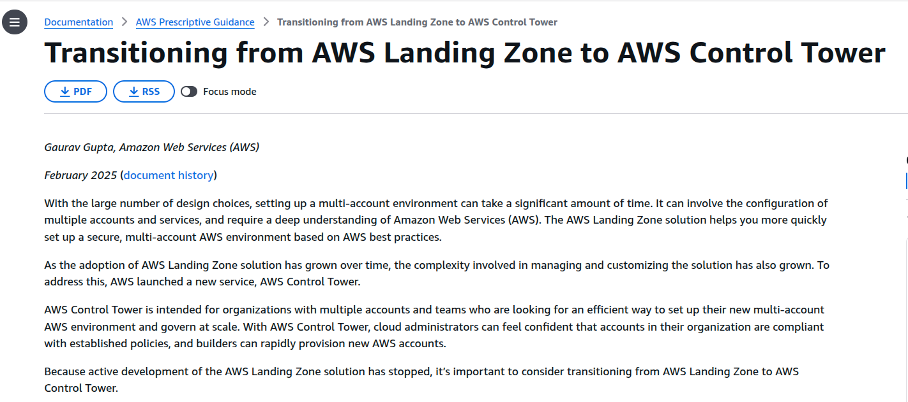
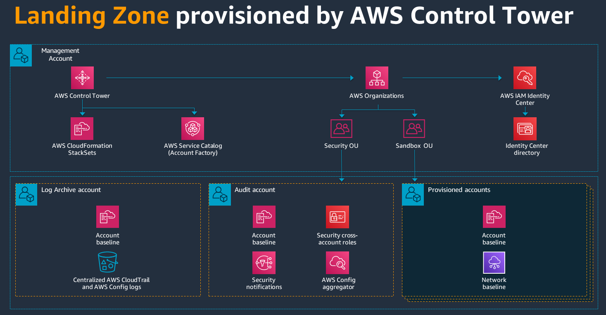
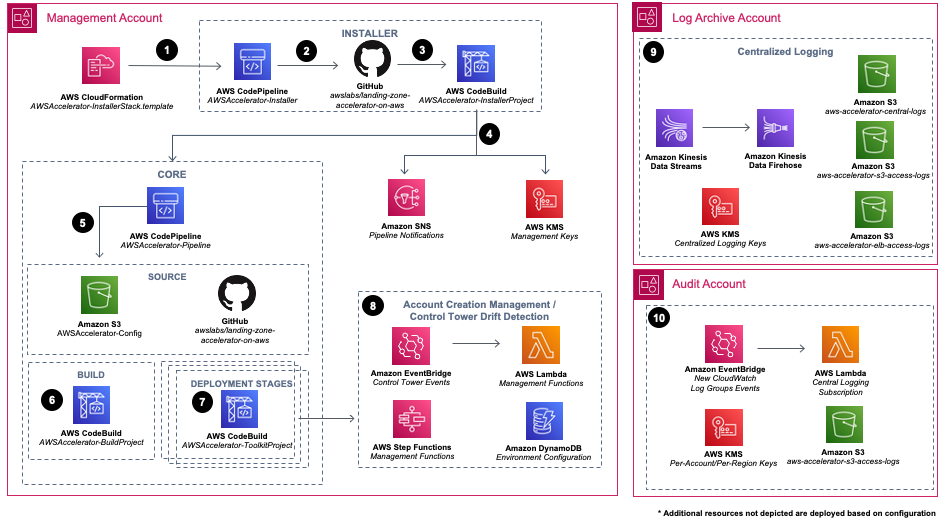

# AWS Landing Zone: Conceptos y contexto

Buenas ... Normalmente escribo sobre serverless en mis posts/artículos técnicos, sin embargo, hoy inauguro una nueva línea que tiene que ver con la "gobernanza en el cloud". El crecimiento del uso del cloud, la adopción de buenas prácticas y la evolución de las organizaciones nos llevan a que la gestión de recursos a gran escala sea parte de nuestro trabajo diario con el cloud.

Después de varios años trabajando con AWS(Amazon Web Services), he visto cómo las organizaciones que empiezan con una sola cuenta terminan con un "caos organizado" cuando crecen. AWS Landing Zone es la solución que ofrece AWS para gestionar este caos organizado.

## 🎯 ¿Qué es AWS Landing Zone y por qué me parece fundamental?

En términos simples, **AWS Landing Zone** es como tener un "plano maestro" para organizar tu infraestructura en AWS. Imagínate que vas a construir un barrio completo: necesitas planificar las calles, los servicios básicos, las zonas residenciales y comerciales antes de empezar a construir casas.

Eso es exactamente lo que hace Landing Zone: nos da una estructura *multi-cuenta* bien organizada, con seguridad integrada desde el día uno y todas las estructuras(logging, monitoreo, compliance) ya conectadas. Es la diferencia entre crecer de forma ordenada o terminar con un laberinto imposible de mantener, al menos en mi experiencia.

## 📅 Evolución Histórica

Como siempre que inicio un nuevo tema o nueva línea de trabajo me parece buen ejercicio rastrear los orígenes, he intentado revisar post, artículos varios y esta sería una línea de tiempo no oficial de cómo AWS Landing Zone llegó a nosotros.

**AWS Landing Zone (Solución original) Antes de 2019**

No he encontrado referencias oficiales directas de lo que era AWS Landing Zone previo a 2019, pero en todos lados tenemos referencia a migrar landing zone(Solucion Original) a control tower por ejemplo el link a continuación: 

> https://docs.aws.amazon.com/prescriptive-guidance/latest/aws-control-tower/introduction.html

Por lo tanto es correcto asumir que teníamos una versión 1, y control tower se presenta como la version 2.0.

**AWS Control Tower ¿cómo llegamos hasta aquí?**


- **24 de junio de 2019**: Disponibilidad general (GA) versión 2.1 ([AWS News Blog](https://aws.amazon.com/blogs/aws/aws-control-tower-set-up-govern-a-multi-account-aws-environment/))
- **Agosto 2019**: Controles detectivos adicionales ([Release Notes](https://docs.aws.amazon.com/controltower/latest/userguide/release-notes.html))
- **Septiembre 2019**: Controles electivos adicionales

- **Noviembre 2019**: Versión 2.2 con controles preventivos contra drift

**Años con Release Notes y Versiones Disponibles:**

- **2019 (v2.1 - v2.2)**: https://docs.aws.amazon.com/controltower/latest/userguide/2019-all.html

- **2020 (v2.3 - v2.6)**: https://docs.aws.amazon.com/controltower/latest/userguide/2020-all.html

- **2021 (v2.7 - v2.9)**: https://docs.aws.amazon.com/controltower/latest/userguide/2021-all.html

- **2022 (v3.0 - v3.1)**: https://docs.aws.amazon.com/controltower/latest/userguide/2022-all.html

- **2023 (v3.2 - v3.3)**: https://docs.aws.amazon.com/controltower/latest/userguide/2023-all.html

- **2024 (v3.3)**: https://docs.aws.amazon.com/controltower/latest/userguide/2024-all.html

- **2025 (v3.3)**: https://docs.aws.amazon.com/controltower/latest/userguide/2025-all.html

## 🍜 Los "ingredientes" de la landing zone a grandes rasgos: 

Control Tower es el elemento principal pero una landing zone realmente es un conjunto de recursos. 

- **AWS Control Tower**: El "cerebro/control" que orquesta todo. Una vez configurado, prácticamente se maneja solo
- **AWS Organizations**: El "árbol genealógico" de cuentas. Aquí defines quién puede hacer qué y dónde
- **AWS SSO (Identity Center)**: Único Login Centralizado para todas las cuentas un SSO de libro...
- **AWS Config**: El "detective" que te avisa cuando algo no está como debería estar configurado
- **AWS Service Catalog**: El "catálogo de productos" donde defines plantillas pre-aprobadas que los equipos pueden usar sin romper nada (en principio)
- **AWS CloudTrail**: El "diario" que registra absolutamente todo lo que pasa en tus cuentas

... y muchos más!

Aquí los elementos mínimos que propone AWS para implementar una AWS Landing Zone



> https://docs.aws.amazon.com/prescriptive-guidance/latest/migration-aws-environment/building-landing-zones.html

## 🏗️ ¿Y cómo orquestamos / construimos todos estos recursos?

Aquí hay un punto importante, AWS ofrece una guía prescriptiva de cómo implementar un landing zone con CloudFormation:



> https://docs.aws.amazon.com/solutions/latest/landing-zone-accelerator-on-aws/architecture-overview.html 

Sin embargo he hecho pruebas y creo que me inclinaría más por Terraform o Pulumi, este es el inicio de esta serie así que ya contaré sobre este tema más adelante.


## ¿A partir de cuántas cuentas tendría que montarme una landing zone?

No hay una recomendación oficial sobre a partir de cuántas cuentas está bien crear una landing zone, creo que esta discusión escapa un poco de este artículo en particular pero es un tema interesante a tratar:

Sin embargo aquí algunas referencias que se pueden encontrar sobre las recomendaciones oficiales de la documentación de AWS:

1. "Más de una cuenta"
• **Fuente**: https://docs.aws.amazon.com/prescriptive-guidance/latest/migration-aws-environment/understanding-landing-zones.html
• **Texto exacto**: "Although there is no standard number of AWS accounts you should have, we recommend that you create more than one AWS account."

2. "Más de un puñado de cuentas"
• **Fuente**: https://docs.aws.amazon.com/controltower/latest/userguide/what-is-control-tower.html
• **Texto exacto**: "If you are hosting more than a handful of accounts, it's beneficial to have an orchestration layer that facilitates account deployment and account 
governance."

### Sobre las cuentas y OU (Unidades Organizacionales)

Bueno supongamos que ya tenemos claro que tenemos muchas cuentas, ahora cómo las organizamos, sobre este aspecto hay mucho escrito, a continuación un ejemplo clásico de cómo se organizan las cuentas.

### Ejemplo clásico

```
Root Organization
├── Security OU (Organizational Unit)
│   ├── Log Archive Account
│   ├── Audit Account
│   └── Security Tooling Account
├── Sandbox OU
│   └── Developer Sandbox Accounts
├── Production OU
│   ├── Production Account 1
│   └── Production Account 2
└── Non-Production OU
    ├── Development Account
    ├── Testing Account
    └── Staging Account
```

Aunque este es un ejemplo clásico el tema es complejo y tiene análisis de estudio grande como se puede ver en los estudios en los White Papers que dejo en este link:

> https://docs.aws.amazon.com/pdfs/whitepapers/latest/aws-overview/aws-overview.pdf  


## 🔗 Recursos y Referencias Oficiales

A continuación y a modo de referencia dejo mis links, no los he leído todos al completo pero los he revisado al menos una vez... 
### Documentación Principal de AWS

- [AWS Control Tower User Guide](https://docs.aws.amazon.com/controltower/latest/userguide/what-is-control-tower.html)
- [AWS Multi-Account Strategy for Landing Zone](https://docs.aws.amazon.com/controltower/latest/userguide/aws-multi-account-landing-zone.html)
- [How AWS Control Tower Works](https://docs.aws.amazon.com/controltower/latest/userguide/how-control-tower-works.html)
- [AWS Organizations Best Practices](https://docs.aws.amazon.com/organizations/latest/userguide/orgs_best-practices.html)

### Whitepapers y Guías Estratégicas

- [Organizing Your AWS Environment Using Multiple Accounts](https://docs.aws.amazon.com/whitepapers/latest/organizing-your-aws-environment/organizing-your-aws-environment.html)
- [How AWS Control Tower Establishes Multi-Account Environment](https://docs.aws.amazon.com/whitepapers/latest/organizing-your-aws-environment/how-does-aws-control-tower-establish-your-multi-account-environment.html)
- [AWS Well-Architected Framework](https://aws.amazon.com/architecture/well-architected/)

### AWS Prescriptive Guidance

- [What is a Landing Zone?](https://docs.aws.amazon.com/prescriptive-guidance/latest/migration-aws-environment/understanding-landing-zones.html)
- [Building a Landing Zone](https://docs.aws.amazon.com/prescriptive-guidance/latest/migration-aws-environment/building-landing-zones.html)
- [Designing an AWS Control Tower Landing Zone](https://docs.aws.amazon.com/prescriptive-guidance/latest/designing-control-tower-landing-zone/introduction.html)
- [Landing Zone for Cloud Migration](https://docs.aws.amazon.com/prescriptive-guidance/latest/strategy-migration/aws-landing-zone.html)
- [Configuring Account Structure and OUs](https://docs.aws.amazon.com/prescriptive-guidance/latest/designing-control-tower-landing-zone/account-structure.html)
- [Centralized Logging and Monitoring](https://docs.aws.amazon.com/prescriptive-guidance/latest/designing-control-tower-landing-zone/logging-monitoring.html)

### Servicios Complementarios

- [Logging and Monitoring in AWS Control Tower](https://docs.aws.amazon.com/controltower/latest/userguide/logging-and-monitoring.html)
- [Nested OUs in AWS Control Tower](https://docs.aws.amazon.com/controltower/latest/userguide/nested-ous.html)
- [Best Practices for Landing Zone Updates](https://docs.aws.amazon.com/controltower/latest/userguide/lz-update-best-practices.html)

### Herramientas de Implementación que vamos a usar en estos post!

- **AWS CLI**: Automatización de tareas
- **Terraform**: Infrastructure as Code (IaC)
- **AWS CDK**: Desarrollo programático (IaC)
- **Pulumi**: Infrastructura as Code (IaC)
- **CloudFormations**: Infrastructure as Code (IaC)

### Comunidad y Soporte

- [AWS Architecture Center](https://aws.amazon.com/architecture/)
- [AWS Samples GitHub](https://github.com/aws-samples)
- [AWS re:Post](https://repost.aws/)

## 💡 Conclusiones

Este post solo pretende ser un punto de partida para compartir todas las experiencias que me he encontrado desplegando AWS Landing Zone, 

gracias por leer, nos vemos

Saludos