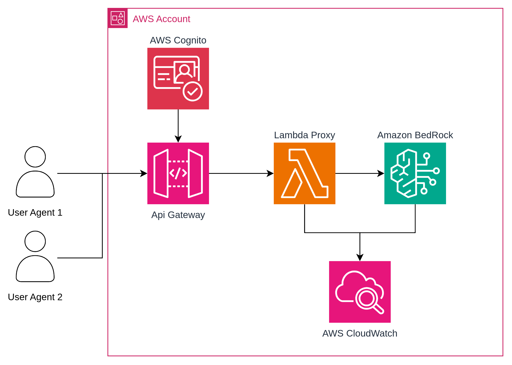

# Arquitectura de acceso a Bedrock para desconfiados (o precavidos) como yo

Hace unas semanas estaba integrando revisión "automática", atentos a las comillas, de Merge Requests en un proyecto interno basicamente una prueba de concepto. La idea era sencilla: el backend llama a un LLM, el LLM revisa el diff y devuelve comentarios. Fácil. El problema llegó cuando empecé a pensar en cómo exponer ese acceso de forma que no me quitara el sueño, sobre todo despues de ver la charla de Pelado Nerd(https://www.youtube.com/watch?v=iqSXHICWa1Y&t=490s) en Nerdearla.

Podría haber llamado a Bedrock directamente desde el backend, si. Técnicamente funciona. Pero eso implica que el backend tiene credenciales/roles AWS, que esas credenciales/roles tienen permisos sobre Bedrock, y que si algo sale mal en el backend, el area de impacto incluye tu cuenta de AWS. No me gustó.

Así que construí una capa intermedia. Este post documenta esa arquitectura y las decisiones detrás de cada pieza.

## 🤔 El problema real: ¿cómo expones Bedrock sin que te dé ansiedad?

Cuando integramos un LLM en un sistema existente, la pregunta no es solo "¿cómo lo llamo?" sino "¿quién puede llamarlo, cuántas veces, y qué puede enviarle?".

En mi caso el sistema que consume el LLM es un backend externo (un issue tracker de GitLab). Ese backend no vive en AWS, no tiene rol IAM, y no debería tener credenciales de larga duración. Necesitaba una forma de:

1. **Autenticar** quién puede hacer requests al LLM
2. **Limitar** cuántos requests puede hacer
3. **Aislar** el acceso a Bedrock del resto del sistema
4. **Controlar** qué llega al modelo (sanitización)

La respuesta fue un proxy: `API Gateway → Lambda → Bedrock`, con Cognito como capa de autenticación y un Usage Plan como freno de mano.

## 🏗️ Arquitectura



Cuatro servicios, cada uno con una responsabilidad clara:

- **Cognito**: gestiona la identidad. El backend se autentica con usuario/contraseña y obtiene un JWT. Sin token válido, API Gateway ni siquiera llega a la Lambda.
- **API Gateway**: valida el token y aplica el Usage Plan. Es el portero.
- **Lambda**: recibe el prompt ya autenticado y lo envía a Bedrock. No sabe nada de usuarios ni de cuotas.
- **Bedrock**: solo recibe llamadas desde la Lambda, nunca desde el exterior.

El backend externo se encarga de sanitizar el prompt y obtener el token de Cognito antes de hacer el request. A partir de ahí, API Gateway valida el token, aplica las cuotas, y solo entonces la Lambda invoca a Bedrock. Cada capa tiene una responsabilidad única y no sabe nada de las demás.

## 🛠️ Implementación con SAM

### Cognito: autenticación con USER_PASSWORD_AUTH

El User Pool está configurado para autenticación por email y contraseña. Los tokens duran 1 hora, lo que permite cachearlos en el backend sin hacer una llamada a Cognito en cada request.

```yaml
UserPool:
  Type: AWS::Cognito::UserPool
  Properties:
    UserPoolName: pr-review-user-pool
    AutoVerifiedAttributes:
      - email
    UsernameAttributes:
      - email
    Policies:
      PasswordPolicy:
        MinimumLength: 8
        RequireUppercase: true
        RequireLowercase: true
        RequireNumbers: true
        RequireSymbols: false

UserPoolClient:
  Type: AWS::Cognito::UserPoolClient
  Properties:
    ClientName: pr-review-client
    UserPoolId: !Ref UserPool
    GenerateSecret: false
    ExplicitAuthFlows:
      - ALLOW_USER_PASSWORD_AUTH
      - ALLOW_REFRESH_TOKEN_AUTH
    AccessTokenValidity: 1
    IdTokenValidity: 1
    TokenValidityUnits:
      AccessToken: hours
      IdToken: hours
```

`GenerateSecret: false` porque el backend llama directamente desde código Python sin un flujo OAuth completo. Para un caso de uso con usuarios reales en un navegador, esto cambiaría.

### API Gateway: el portero con cuotas

El Cognito Authorizer valida el JWT en cada request antes de que llegue a la Lambda. El Usage Plan añade una segunda capa: aunque el token sea válido, hay un límite de 2 req/s sostenido, 5 en ráfaga y 200 al mes.

```yaml
PRReviewApi:
  Type: AWS::Serverless::Api
  Properties:
    Name: pr-review-api
    StageName: prod
    Auth:
      DefaultAuthorizer: CognitoAuthorizer
      Authorizers:
        CognitoAuthorizer:
          UserPoolArn: !GetAtt UserPool.Arn
      UsagePlan:
        CreateUsagePlan: PER_API
        Throttle:
          RateLimit: 2
          BurstLimit: 5
        Quota:
          Limit: 200
          Period: MONTH
```

200 requests al mes puede parecer poco, pero para revisión de MRs en un equipo pequeño es más que suficiente. Y si alguien intenta abusar del endpoint, el Usage Plan lo frena antes de que llegue a Bedrock (que sí tiene costo por token).

### Lambda: el handler mínimo

La Lambda hace exactamente una cosa: recibir el prompt y llamar a Bedrock. Sin lógica de autenticación, sin gestión de cuotas, sin estado.

```python
import boto3
import json
import os

bedrock = boto3.client("bedrock-runtime", region_name=os.environ["AWS_REGION"])
MODEL   = os.environ["BEDROCK_MODEL_ID"]


def lambda_handler(event, context):
    try:
        body = json.loads(event.get("body") or "{}")
        prompt = body.get("prompt", "").strip()
        if not prompt:
            return _response(400, {"error": "prompt is required"})

        result = _invoke(prompt)
        return _response(200, {"result": result, "model": MODEL})

    except bedrock.exceptions.ValidationException as e:
        return _response(400, {"error": str(e)})
    except bedrock.exceptions.ModelTimeoutException:
        return _response(504, {"error": "Model timed out — try with fewer files"})
    except Exception as e:
        return _response(500, {"error": str(e)})


def _invoke(prompt: str) -> str:
    response = bedrock.invoke_model(
        modelId=MODEL,
        body=json.dumps({
            "anthropic_version": "bedrock-2023-05-31",
            "max_tokens": 4096,
            "messages": [{"role": "user", "content": prompt}],
        }),
    )
    data = json.loads(response["body"].read())
    return data["content"][0]["text"]


def _response(status: int, body: dict) -> dict:
    return {
        "statusCode": status,
        "headers": {"Content-Type": "application/json"},
        "body": json.dumps(body),
    }
```

La política IAM de la Lambda es mínima: solo `bedrock:InvokeModel`. Nada más.

```yaml
PRReviewFunction:
  Type: AWS::Serverless::Function
  Properties:
    FunctionName: pr-review-bedrock
    Handler: handler.lambda_handler
    CodeUri: src/
    Policies:
      - Statement:
          - Effect: Allow
            Action: bedrock:InvokeModel
            Resource: "*"
```

El `Resource: "*"` en `bedrock:InvokeModel` es una decisión consciente. Los inference profiles de Claude (los modelos nuevos con prefijo `us.`) tienen ARNs distintos a los foundation models, y mantener una lista actualizada de ARNs en la policy es más frágil que acotar solo la acción. La Lambda no tiene ningún otro permiso, así que el riesgo real es mínimo.

## 🚀 Despliegue

```bash
# Primera vez
sam build
sam deploy --guided --region us-east-1

# Con modelo específico (Claude Haiku 4.5 requiere inference profile)
sam build && sam deploy --region us-east-1 \
  --parameter-overrides BedrockModelId=us.anthropic.claude-haiku-4-5-20251001-v1:0
```

> Los modelos Claude de generación nueva (Haiku 4.5+, Sonnet 4+) requieren el prefijo `us.` que apunta al inference profile cross-region. Sin el prefijo el deploy funciona pero las invocaciones fallan con `ValidationException`. Me costó un rato entender esto la primera vez.

Los outputs del deploy dan todo lo necesario:

```
UserPoolId        us-east-1_XXXXXXXXX
UserPoolClientId  XXXXXXXXXXXXXXXXXXXXXXXXXX
ApiUrl            https://XXXXXXXXXX.execute-api.us-east-1.amazonaws.com/prod/review
```

## 🧪 Verificar que funciona

Primero crear el usuario Cognito (paso manual, una sola vez):

```bash
# Crear usuario
aws cognito-idp admin-create-user \
  --region us-east-1 \
  --user-pool-id <UserPoolId> \
  --username <email> \
  --temporary-password <TempPass1!> \
  --message-action SUPPRESS

# Setear password permanente
# Sin este paso el auth falla con FORCE_CHANGE_PASSWORD
aws cognito-idp admin-set-user-password \
  --region us-east-1 \
  --user-pool-id <UserPoolId> \
  --username <email> \
  --password <FinalPass1!> \
  --permanent
```

Luego probar el endpoint:

```bash
# Obtener token
TOKEN=$(aws cognito-idp initiate-auth \
  --region us-east-1 \
  --auth-flow USER_PASSWORD_AUTH \
  --client-id <UserPoolClientId> \
  --auth-parameters USERNAME=<email>,PASSWORD=<password> \
  --query 'AuthenticationResult.IdToken' \
  --output text)

# Llamar al endpoint
curl -s -X POST \
  <ApiUrl> \
  -H "Authorization: $TOKEN" \
  -H "Content-Type: application/json" \
  -d '{"prompt": "Di hola en una línea"}' | jq .
```

Respuesta esperada:

```json
{
  "result": "¡Hola!",
  "model": "us.anthropic.claude-haiku-4-5-20251001-v1:0"
}
```

## 💡 Decisiones de diseño que vale la pena explicar

### Timeout 25s en Lambda

API Gateway tiene un hard limit de 29s que no se puede cambiar. La Lambda está en 25s para que falle con un error controlado (`ModelTimeoutException → 504`) antes de que API GW corte la conexión con un 504 genérico sin cuerpo. Pequeño detalle que mejora mucho el debugging.

### Token Cognito cacheado en el backend

El backend cachea el IdToken durante 55 minutos (el token dura 1h). Evita una llamada a Cognito en cada request. Si llega un 401 desde API GW, el caché se invalida y se re-autentica automáticamente. Esto es importante porque Cognito tiene sus propios límites de rate en `InitiateAuth`.

### El sanitizador: lo que no debe llegar al modelo

Este es el punto que más me importa de toda la arquitectura. Antes de construir el prompt, el diff del MR pasa por un sanitizador que elimina:

- Tokens AWS (`AKIA...`, `aws_secret_access_key`)
- IPs internas y dominios privados
- JWTs y API keys con patrones conocidos
- Cualquier string que parezca una credencial

No porque desconfíe de Bedrock específicamente, sino porque es una buena práctica no enviar datos sensibles a ningún servicio externo, sea cual sea. El modelo no necesita saber tu IP interna para revisar un diff de código.

### Por qué no llamar a Bedrock directamente desde el backend

La alternativa más simple habría sido darle al backend un IAM user con permisos sobre Bedrock. Funciona, pero:

- Las credenciales de larga duración son un riesgo si el backend se compromete
- No hay forma nativa de limitar cuántas llamadas hace sin instrumentación adicional
- Si el backend tiene un bug que genera un bucle de llamadas, la factura de Bedrock crece sin freno
- Agregar un circuit breaker en caso de que suceda algo similar a lo que comento Pablo En nerdearla.

Con este proxy, el peor caso es que alguien agote el Usage Plan del mes (200 requests). Eso es un problema operativo, no un problema de seguridad ni de costos descontrolados.

## ⚠️ Consideraciones

### Sobre el Usage Plan
200 req/mes es el valor para un equipo pequeño. Para un equipo más grande o un caso de uso diferente, ajustar `Quota.Limit` en el `template.yaml` antes del redeploy.

### Sobre los modelos disponibles
Para ver qué modelos Claude están activos en us-east-1:

```bash
aws bedrock list-foundation-models --region us-east-1 \
  --query "modelSummaries[?contains(modelId, 'claude')].{id:modelId,status:modelLifecycle.status}" \
  --output table
```

Usar siempre modelos con `status: ACTIVE` y prefijo `us.` al deployar.

### Sobre el `samconfig.toml`
El archivo `samconfig.toml` contiene el stack name, región y el `parameter_overrides` con el modelo. Como es un ejemplo, el repositorio incluye `samconfig.toml.example` para copiar y adaptar. El `samconfig.toml` real está en `.gitignore`.

## 📋 Conclusiones

Esta arquitectura no es la más simple para acceder a Bedrock, pero es la que me deja más tranquilo en producción. El resumen de lo que ganamos con cada capa:

| Capa | Qué protege |
|------|-------------|
| Sanitizador | Datos sensibles que no deben salir del entorno |
| Cognito | Acceso no autenticado al endpoint |
| Usage Plan | Abuso de costos y rate abuse |
| Lambda con permisos mínimos | Radio de explosión si la Lambda se compromete |
| Bedrock solo accesible desde Lambda | Superficie de ataque directa a AWS |

¿Es necesario todo esto para un proyecto personal o una POC? Probablemente no. ¿Para un sistema que toca código de producción de un equipo? Yo diría que sí.

El código completo está disponible en [GitHub](https://github.com/olcortesb/aws-examples/tree/main/bedrock/proxy-lambda-bedrock) y listo para desplegar con SAM.

---

Gracias por leer.

¡Saludos!

Oscar Cortés
