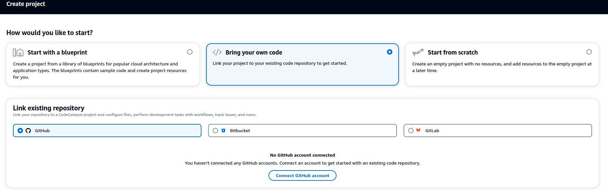
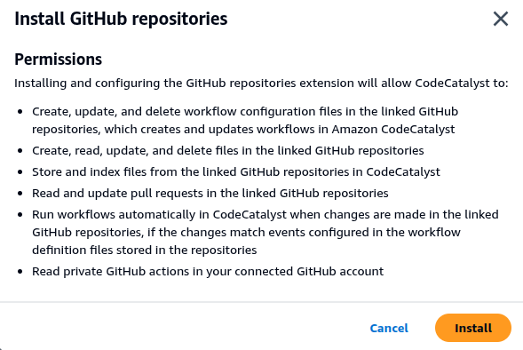
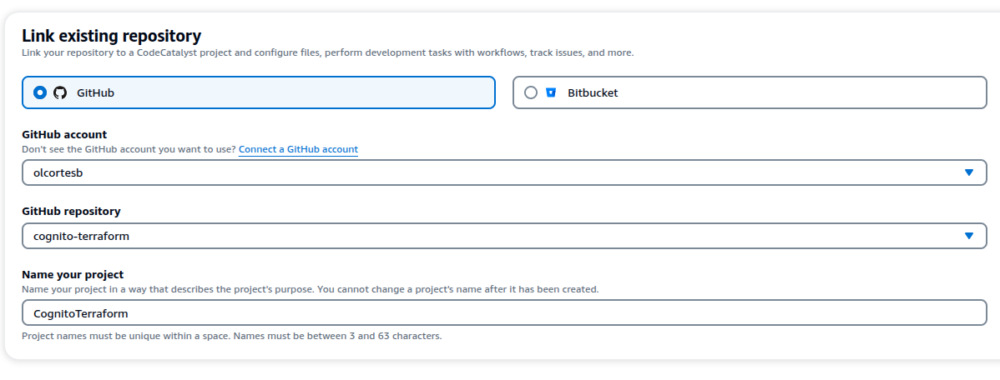
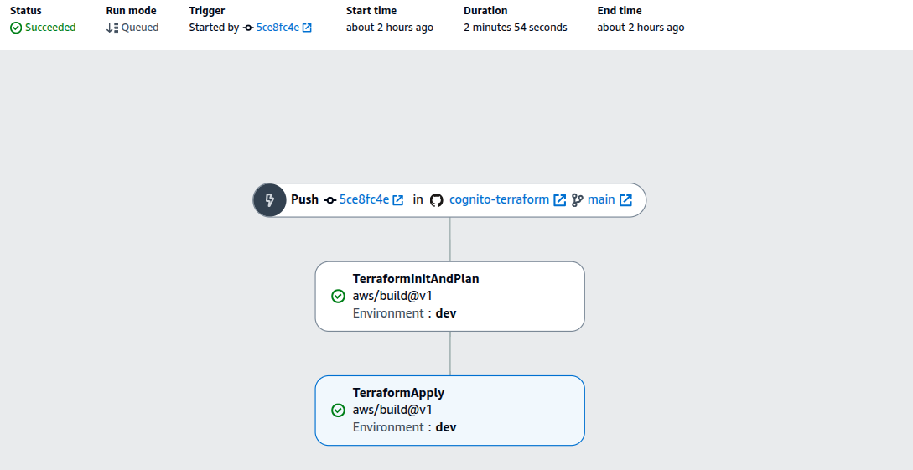

# Integrando CodeCatalyst con GitHub y Terraform: Desplegando AWS Cognito

Buenas de nuevo, siguiendo con el descubrimiento del servicio AWS CodeCatalyst. En este artículo exploraremos cómo integrar AWS CodeCatalyst con un repositorio de GitHub existente para automatizar el despliegue de infraestructura usando Terraform, específicamente para AWS Cognito.

## 🚀 ¿Qué vamos a integrar?

**AWS CodeCatalyst** como plataforma de CI/CD, **GitHub** como repositorio de código fuente, y **Terraform** para Infrastructure as Code, desplegando recursos de **AWS Cognito**.


## 🛠️ Prerrequisitos

- Cuenta de AWS
- AWS Builder ID configurado
- Acceso a CodeCatalyst
- Repositorio GitHub: https://github.com/olcortesb/cognito-terraform


## 📋 Configuración Inicial

### Paso 1: Conectar repositorio GitHub a CodeCatalyst
Dentro de code catalyst: https://codecatalyst.aws/ en el espacio que tengamos de trabajo creamos un nuevo proyecto:



Aceptamos términos y condiciones:



Especificar el repositorio y aceptar:


```bash
# Clonar el repositorio de ejemplo
git clone https://github.com/olcortesb/cognito-terraform.git
```

### Paso 2: Configurar variables de Terraform

El código de Terraform es el mismo que utilizamos en un *post* anterior para desplegar AWS Cognito. [Ver artículo](https://olcortesb.hashnode.dev/desplegar-aws-cognito-y-una-aplicacion-cliente-con-terraform)
```hcl
# Variables principales para Cognito
variable "user_pool_name" {
  description = "Name of the Cognito User Pool"
  type        = string
}
```

## 🔧 Implementación

### Creación del Workflow de Terraform

En CodeCatalyst, creamos un workflow que automatiza el proceso de despliegue de Terraform en dos etapas: **Plan** y **Apply**. Aquí una recomendación es crear el yaml directamente dentro del código del proyecto similar a como trabajamos con GitHub Actions y GitLab. La dirección y estructura es la siguiente:

```bash
# Ruta del .yaml que define el pipeline
.codecatalyst/workflows/onPushToMainDeploymentWorkflow.yaml
```
Y el código dentro del yaml: 
```yml
Name: onPushToMainDeploymentWorkflow
SchemaVersion: "1.0"

# ---------------------------------------------------------------------------------
# Trigger: Se activa con cada push a la rama 'main'
# ---------------------------------------------------------------------------------
Triggers:
  - Type: PUSH
    Branches:
      - main

# ---------------------------------------------------------------------------------
# Actions: Define los pasos del flujo de trabajo
# ---------------------------------------------------------------------------------
Actions:
  # -------------------------------------------------------------------------------
  # PASO 1: Inicializa Terraform y crea un plan de ejecución.
  # El plan se guarda como un artefacto para usarlo en el siguiente paso.
  # -------------------------------------------------------------------------------
  TerraformInitAndPlan:
    Identifier: aws/build@v1
    Compute:
      Type: EC2
      Fleet: Linux.x86-64.Large
    Inputs:
      Sources:
        - WorkflowSource
    Outputs:
      Artifacts:
        - Name: TerraformPlanArtifact
          Files:
            - tfplan
            - ".terraform.lock.hcl"
            - ".terraform/**"
    Configuration:
      Steps:
        - Run: |
            wget https://releases.hashicorp.com/terraform/1.9.8/terraform_1.9.8_linux_amd64.zip
            unzip terraform_1.9.8_linux_amd64.zip
            chmod +x terraform
        - Run: ./terraform init
        - Run: ./terraform plan -var="environment=dev" -var="region=eu-central-1" -out=tfplan
    Environment:
      Name: dev
      Connections:
        - Name: <your-aws-account>
          Role: CodeCatalystWorkflowDevelopmentRole-<your-space>

  # -------------------------------------------------------------------------------
  # PASO 2: Aplica el plan de Terraform creado en el paso anterior.
  # Depende de que 'TerraformInitAndPlan' haya finalizado con éxito.
  # -------------------------------------------------------------------------------
  TerraformApply:
    Identifier: aws/build@v1
    DependsOn:
      - TerraformInitAndPlan
    Compute:
      Type: EC2
      Fleet: Linux.x86-64.Large
    Inputs:
      Sources:
        - WorkflowSource
      Artifacts:
        - TerraformPlanArtifact
    Configuration:
      Steps:
        - Run: |
            wget https://releases.hashicorp.com/terraform/1.9.8/terraform_1.9.8_linux_amd64.zip
            unzip terraform_1.9.8_linux_amd64.zip
            chmod +x terraform
        - Run: |
            echo "Checking all directories recursively:"
            find / -name "*tfplan*" 2>/dev/null || true
            echo "Checking CODEBUILD environment variables:"
            env | grep -i artifact || true
            echo "Checking for any terraform files:"
            find . -name "*.tf*" -type f
        - Run: ./terraform init
        - Run: |
            echo "Re-creating plan in apply step as workaround:"
            ./terraform plan -var="environment=dev" -var="region=eu-central-1" -out=tfplan
        - Run: ./terraform apply -auto-approve tfplan
    Environment:
      Name: dev
      Connections:
        - Name: <your-aws-account>
          Role: CodeCatalystWorkflowDevelopmentRole-<your-space>

```
Ejemplo de como se ve visualmente el pipeline que hemos implementado después de ejecutarlo:




### Características del Workflow

**Estructura de dos etapas:**
1. **TerraformInitAndPlan**: Descarga Terraform, inicializa el proyecto y crea un plan
2. **TerraformApply**: Aplica los cambios usando el plan generado

**Configuración clave:**
- **Compute**: `EC2` con `Fleet: Linux.x86-64.Large` para mejor rendimiento
- **Environment**: `dev` con conexión a la cuenta AWS
- **Artefactos**: Transfiere el plan entre etapas (con incidencia conocida)
- **Variables**: `environment=dev` y `region=eu-central-1`

### Incidencia con Artefactos

⚠️ **Problema conocido**: Los artefactos en este ejemplo no se transfieren correctamente entre etapas en CodeCatalyst. Al menos yo no he podido 😂, estoy revisando por qué no los puedo pasar. Al final, este es un camino de conocimiento de CodeCatalyst. 

**Workaround implementado:**
- Se reinstala Terraform en ambas etapas
- Se regenera el plan en la etapa Apply
- Se mantiene la estructura de dos etapas para demostración

## 🧪 Pruebas y Validación

### Verificar el despliegue de Cognito

Una vez ejecutado el workflow, verificamos que los recursos se crearon correctamente:

```bash
# Verificar User Pool en AWS CLI

aws cognito-idp list-user-pools --max-results 10 --region eu-central-1 | \
  jq '.UserPools[] | select(.Name | contains("<your-user-pool-name>"))'

# Output
# {
#   "Id": "eu-central-1_XXXXXXXXX",
#   "Name": "<your-user-pool-name>",
#   "LambdaConfig": {},
#   "LastModifiedDate": "2025-08-26T19:42:05.460000+02:00",
#   "CreationDate": "2025-08-26T19:42:05.460000+02:00"
# }

# Verificar desde la consola AWS
# Cognito → User Pools → Buscar el pool creado
```

## 🚀 Análisis del Despliegue

### Configurado para push en rama main

El despliegue se ejecuta automáticamente con cada push a la rama `main`:

Análisis de los elementos del .yaml

1. **Trigger**: Push a main activa el workflow
2. **Plan Stage**: Descarga Terraform, inicializa y planifica
3. **Apply Stage**: Aplica los cambios en AWS
4. **Resultado**: Recursos de Cognito desplegados


## 📊 Resultados y conclusiones

- ✅ **Integración** entre CodeCatalyst, GitHub y Terraform
- ✅ **Automatización** del despliegue de infraestructura
- ✅ **Despliegue de AWS Cognito** usando Terraform
- ✅ **Pipeline de CI/CD** funcional con dos etapas
- ⚠️ **Gestión de artefactos** (con workaround para incidencia)

**Recursos creados:**
- AWS Cognito User Pool
- Configuración de cliente para autenticación
- Políticas de seguridad asociadas

## 💡 Buenas Prácticas

- ✅ **Usar Environment específico** para cada etapa de despliegue
- ✅ **Separar Plan y Apply** en etapas diferentes para mejor control, también podemos configurar el apply manual, pero lo dejamos para otro post...
- ✅ **Incluir validación** antes del plan para detectar errores temprano
- ✅ **Usar Fleet EC2 Large** para mejor rendimiento en proyectos grandes


## 🔗 Referencias y Enlaces Útiles

- [*Post* anterior: Probando AWS CodeCatalyst desde el AWS Builder ID](https://olcortesb.hashnode.dev/probando-aws-codecatalyst-desde-el-aws-builder-id)
- [*Post* anterior de cognito + terraform](https://olcortesb.hashnode.dev/desplegar-aws-cognito-y-una-aplicacion-cliente-con-terraform)
- [AWS CodeCatalyst Documentation](https://docs.aws.amazon.com/codecatalyst/)
- [CodeCatalyst Workflows](https://docs.aws.amazon.com/codecatalyst/latest/userguide/workflows.html)
- [Terraform AWS Cognito](https://registry.terraform.io/providers/hashicorp/aws/latest/docs/resources/cognito_user_pool)
- [Repositorio de ejemplo](https://github.com/olcortesb/cognito-terraform)
- [GitHub Integration with CodeCatalyst](https://docs.aws.amazon.com/codecatalyst/latest/userguide/source-repositories-link.html)
- [CodeCatalyst Artifacts](https://docs.aws.amazon.com/codecatalyst/latest/userguide/workflows-artifacts.html)


Gracias por leer, Saludos…