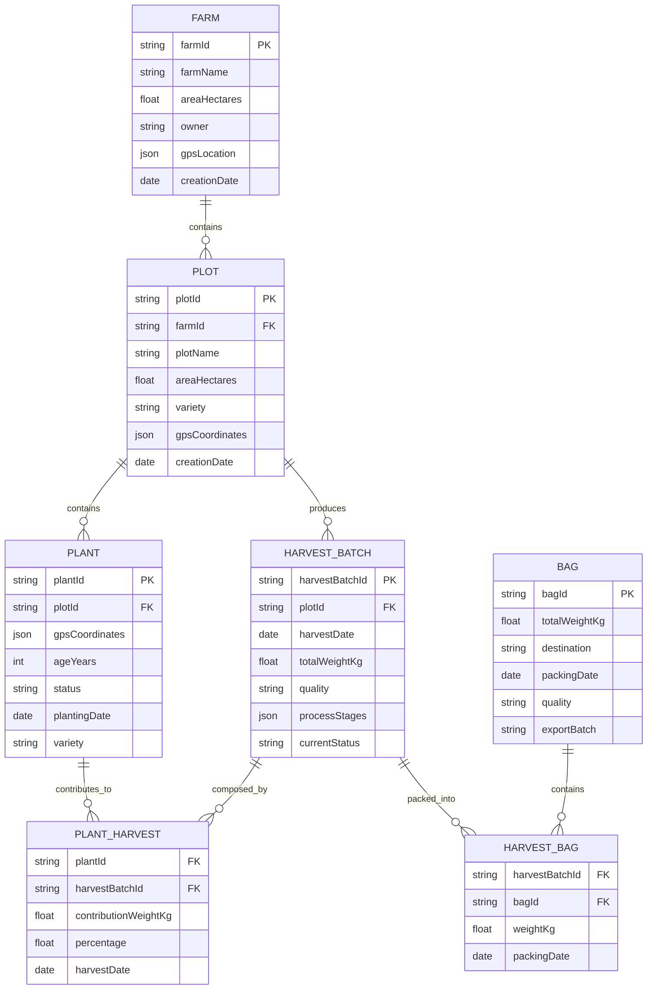

Normalmente, escribo artículos técnicos directos; sin embargo, después de algunas charlas y buenos Cafés con Samuel ([connexus](https://www.connexus.coffee/)) me doy a la tarea de una seria de artículos con una aplicación práctica de todas las cosas que normalmente hablamos en los anteriores post.

El caso de uso: en una búsqueda de un uso con sentido de este desbordamiento de datos e información en el que vivimos, me trasmitió su intención de tener la posibilidad de tener una historia una traza, un camino, desde el momento que se siembra una planta de café al momento que se coloca en la taza de un cliente o que se vende una bolsa de café tostado.

Con esto en mente y mi ya conocida afición por las aplicaciones Serverles me di a la tarea de diseñar una API que permita trazar este camino utilizando **AWS Lambda** y **DynamoDB**.

Lo primero es entender cuáles son las etapas que se quieren registrar en el proceso: Siembra, cosecha, despulpado, fermentación, secado, trillado, empaque, traslado, tostado.

> Dejo por aqui un articulo de Samuel donde cuenta en detalle las etapas del proceso. Link

El ciclo de vida del proceso agrícola es estacionario por naturaleza, con esto en mente claramente pensé en un sistema Serverless como primera opción con AWS Lambda como sistema de cómputo y DynamoDB como almacenamiento de datos. El procesamiento de la API, no tendrá una complejidad, pero si la estructura de los datos, veamos un poco qué datos necesitamos en cada etapa:

## La planta como eje principal del diseño:

La planta será el elemento principal del diseño de la estructura de datos, los elementos que tendrás son la posición en el terreno, varietal, y los datos que permitan identificar el proceso de crecimiento, producción y salud de la misma. Sin embargo la planta sola no nos dara toda la informacion de la trasabilidad necesitamos relacionarla con otros elementos de proceos, Lote, sacos, etc, ahora la pregunta , una sola tabla o single table design? …

```json
{
  "plantId": "550e8400-e29b-41d4-a716-446655440000",
  "plotId": "PLT-2024-001",
  "harvestBatchId": "HB-2024-001",
  "variety": "Coffea arabica var. Caturra",
  "plantingDate": "2024-01-15T08:00:00Z",
  "stages": [
    {
      "date": "2024-01-15T08:00:00Z", 
      "stage": "planting", 
      "responsible": "Juan Pérez",
      "notes": "Certified seed, optimal conditions"
    },
    {
      "date": "2024-02-01T06:30:00Z", 
      "stage": "irrigation", 
      "quantity": "50L",
      "method": "drip",
      "waterPh": 6.5
    },
    {
      "date": "2024-11-15T05:00:00Z", 
      "stage": "harvest", 
      "quantity": "12.5kg",
      "quality": "specialty",
      "brix": 22.5
    }
  ],
  "location": {
    "latitude": 4.5981,
    "longitude": -74.0758,
    "altitude": 1850,
    "region": "Huila, Colombia"
  },
  "characteristics": {
    "ageMonths": 10,
    "heightCm": 180,
    "healthStatus": "excellent",
    "estimatedYieldKg": 15
  },
  "images": [
    "s3://connexus-images/plants/550e8400-e29b-41d4-a716-446655440000/planting.jpg",
    "s3://connexus-images/plants/550e8400-e29b-41d4-a716-446655440000/growth.jpg"
  ]
}
```

## Single table desing para sacar la mejor version de DynamoDB

Creo que más de una vez he dejado por aquí o he contado en algúna de mis charlas los que este artículo de [Alex Debrie](https://www.alexdebrie.com/) me ha enseñado: [https://www.alexdebrie.com/posts/dynamodb-single-table/](https://www.alexdebrie.com/posts/dynamodb-single-table/), el artículo de *Single Table Desing* explica el porqué, cuando es útil y como tendríamos que pensarlo, y para este ejercicio creo que es un excelente caso de uso para implementarlo, primero revisemos las relaciones entre la planta su terreno y un saco de café.



Ahora pensemos el diseño de la tabla Single Table Desing…

```c
┌──────────────────┬──────────────────┬─────────────────────────────┐
│       PK         │       SK         │           Data              │
├──────────────────┼──────────────────┼─────────────────────────────┤
│ FARM#F001        │ METADATA         │ {farmName, area, owner}     │
│ FARM#F001        │ PLOT#PLT001      │ {plotName, area, variety}   │
│ FARM#F001        │ PLOT#PLT002      │ {plotName, area, variety}   │
├──────────────────┼──────────────────┼─────────────────────────────┤
│ PLOT#PLT001      │ METADATA         │ {farmId, variety, area}     │
│ PLOT#PLT001      │ PLANT#P001       │ {coordinates, age, status}  │
│ PLOT#PLT001      │ PLANT#P002       │ {coordinates, age, status}  │
│ PLOT#PLT001      │ HARVEST#HB001    │ {harvestDate, weight}       │
├──────────────────┼──────────────────┼─────────────────────────────┤
│ PLANT#P001       │ METADATA         │ {plotId, variety, status}   │
│ PLANT#P001       │ HARVEST#HB001    │ {contributionWeight, date}  │
│ PLANT#P001       │ BAG#B001         │ {finalBag, packingDate}     │
├──────────────────┼──────────────────┼─────────────────────────────┤
│ HARVEST#HB001    │ METADATA         │ {plotId, harvestDate, weight}│
│ HARVEST#HB001    │ STAGE#HARVEST    │ {date, worker, weight}      │
│ HARVEST#HB001    │ STAGE#DEPULPING  │ {machine, yield}            │
│ HARVEST#HB001    │ STAGE#FERMENTATION│ {initialPh, finalPh}       │
│ HARVEST#HB001    │ STAGE#DRYING     │ {method, finalMoisture}     │
│ HARVEST#HB001    │ STAGE#HULLING    │ {greenWeight, classification}│
│ HARVEST#HB001    │ STAGE#ROASTING   │ {profile, temperature}      │
│ HARVEST#HB001    │ STAGE#PACKING    │ {type, unitQuantity}        │
│ HARVEST#HB001    │ PLANT#P001       │ {contributedWeight}         │
│ HARVEST#HB001    │ PLANT#P002       │ {contributedWeight}         │
│ HARVEST#HB001    │ BAG#B001         │ {packedWeight, date}        │
├──────────────────┼──────────────────┼─────────────────────────────┤
│ BAG#B001         │ METADATA         │ {totalWeight, destination}  │
│ BAG#B001         │ HARVEST#HB001    │ {originHarvest, weight}     │
│ BAG#B001         │ HARVEST#HB002    │ {originHarvest, weight}     │
└──────────────────┴──────────────────┴─────────────────────────────┘
```

Bueno, una vez definido el dingle table design con los patrones de acceso en mentes que tendríamos que hacer con las lambdas:

## Las lambdas entran en escena:

¿Ahora, con una visión general de nuestra estructura de datos que endpoints tendríamos que crear para cubrir el proceso?, en una revisión inicial, los endpoints que hemos identificado son los siguientes:

```bash
# Farm and Plot Management
POST /farm/create         → Create new farm
POST /farm/{id}/plot      → Add plot to farm
GET /farm/{id}/plots      → List farm plots
POST /plot/{id}/plant     → Add plant to plot
GET /plot/{id}/plants     → List plot plants

# Harvest Management
POST /plot/{id}/harvest   → Create harvest batch from plot
GET /harvest/{id}/plants  → Plants that contributed to harvest
GET /plant/{id}/harvests  → Harvest batches from plant

# Coffee Processing
PUT /harvest/{id}/depulp  → Register depulping process
PUT /harvest/{id}/ferment → Fermentation control
PUT /harvest/{id}/dry     → Drying process
PUT /harvest/{id}/hull    → Hulling process
PUT /harvest/{id}/roast   → Roasting process
PUT /harvest/{id}/pack    → Pack into bags

# Bag Management
POST /bag/create          → Create bag from harvest batches
GET /bag/{id}/harvests    → Harvest batches in bag
GET /bag/{id}/traceability → Full traceability to plants

# Traceability
GET /plant/{id}/full-trace     → Complete plant to bag journey
GET /plot/{id}/production      → Plot production history
GET /farm/{id}/total-production → Total farm production
GET /reports/yield             → Yield metrics
```

## Un toque de realidad:

Bien, hemos dicho antes que esto es una aplicación real, así que vamos a sacar la calculadora y vamos a hacer una estimación de volumetría de cuantos registros por año podrían ser para el diseño que hemos pensado. Será una estimación, pero intentemos crear un sistema para actualizarlo de manera sencilla y validar con los valores reales.

**Supuestos de Producción:**

* **Plantas**: 10,000 plantas de café
    
* **Cosechas por año**: 2 cosechas (principal y mitaca)
    
* **Lotes por cosecha**: 1 lote cada 2 meses = 6 lotes/año
    
* **Plantas por lote**: 500 plantas promedio
    
* **Sacos por lote**: 20 sacos promedio
    
* **Plantas por saco**: 25 plantas promedio
    

Con estas estimaciones revisemos cuantos registros podemos agegar a la DynamoDB por año:

````bash
**Cálculos Anuales:**
```
Registros por Año:
├── Plantas (base): 10,000 registros
├── Lotes: 6 lotes/año
│   ├── Metadata: 6 registros
│   ├── Etapas (7 por lote): 6 × 7 = 42 registros
│   └── Relaciones planta-lote: 6 × 500 = 3,000 registros
├── Sacos: 6 lotes × 20 sacos = 120 sacos/año
│   ├── Metadata: 120 registros
│   └── Relaciones planta-saco: 120 × 25 = 3,000 registros
└── Relaciones terreno-planta: 10,000 registros (una vez)

Total Anual: 16,168 registros nuevos/año
```
````

Lo que nos da una proyección a 10 años de 170 mil registros Aproximadamente, lo que válida, al menos en este proceso de diseño el uso de una sola tabla *Single table Desing* para este problema.

## Siguientes pasos:

Bueno, una vez terminado el diseño, el paso siguiente es realizar una prueba de concepto y validar que los patrones de accesos sean los que hemos diseñado. Seguramente será necesario revisar los procesos y ajustar parámetros de diseño para el caso particular de Connexus.

En algún próximo post contaré un poco más del proceso de construcción de estas APIs, utilizando, seguramente, AWS cogito para gestionar los usuarios que tengan que participar en el proceso.

Gracias por leer,

Saludos!