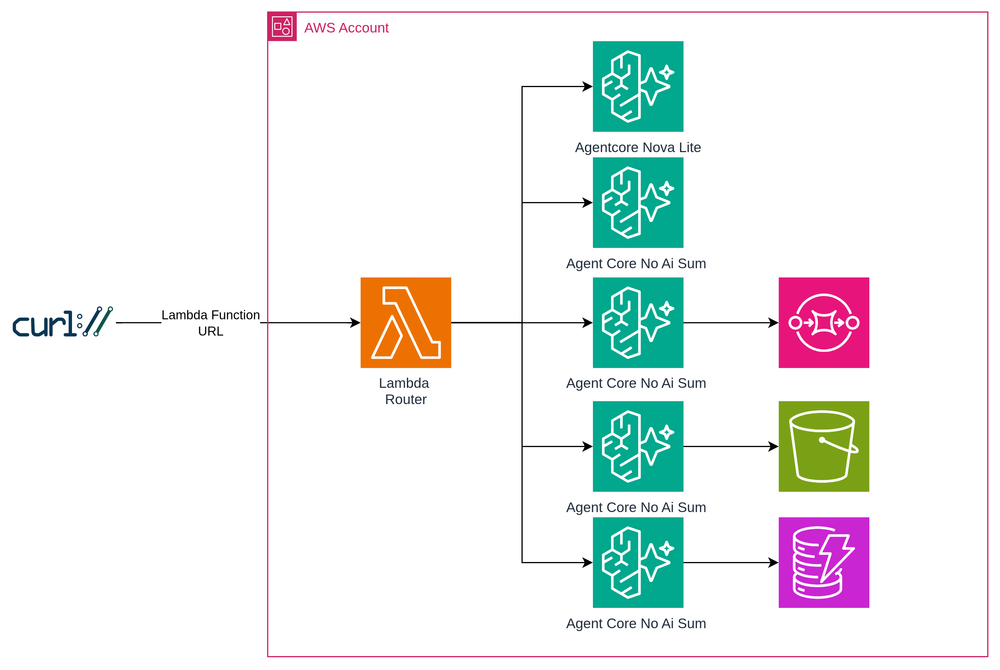

# is-agentcore-the-new-lambda ?
Oscar Cortes
olcortesb@gmail.com

An investigation of how AgentCore works and whether it could become the new Lambda.

## Context

The last [AWS Community Day Spain 2025 Zaragoza](https://awscommunity.es/) took place on Saturday, November 15, 2025. The keynote *"Now Go Unbuild"* was delivered by [Álvaro Hernández Tortosa](https://www.linkedin.com/in/ahachete/). who introduced five "out-of-the-box" challenges regarding AWS services. One specific challenge stood out: "Is AgentCore the new Lambda?"

## Hands On

I accepted this challenge. In this repository, I test the feasibility of running AgentCore as a next-generation version of Lambda. Testing the boundaries of what works—and what doesn't—is, in my opinion, the best way to learn.

The project evolved in two phases:

- Phase 1: Proof of concept using the AgentCore CLI toolkit (agentcore deploy).

- Phase 2: Migration to Terraform for full Infrastructure-as-Code (IaC) control, removing CLI dependencies, and implementing a single Lambda Function URL that routes to all five experiments.

## What is AgentCore?

Amazon Bedrock AgentCore is an AWS service designed as a foundation for building, deploying, and operating AI agents at scale. It offers a serverless-style infrastructure for agent workloads, including:

- Serverless runtime

- Memory management for short and long-term context

- Tool integration via AgentCore Gateway

- Secure authentication

## Architecture of the Experiment



### Terraform Module

Each agent is deployed using a reusable Terraform module (`modules/agentcore-runtime/`) that encapsulates all the infrastructure needed for a single AgentCore runtime. This module creates:

- **ECR Repository**: Stores the Docker image for the agent container
- **IAM Role**: Execution role with ECR pull permissions and optional extra policies (SQS, S3, DynamoDB)
- **AgentCore Memory**: Persistent memory resource for session context
- **AgentCore Runtime**: The actual runtime that executes the agent container

The module accepts parameters like `agent_name`, `extra_policy_arns`, and `environment_variables`, making it easy to deploy new agents by simply defining a new module block with different configurations. Docker images are built locally and pushed to ECR, then referenced by the runtime via the image URI.

This modular approach allows each step (step0 through step4) to share the same infrastructure pattern while varying only the agent code and AWS service integrations.

## Experiments

### Step 0: AgentCore with AI Model (Nova Lite) The base line!

**Agent:** `terraform/agents/step0_nova/`

AgentCore with Amazon Nova Lite model via the Bedrock Converse API. Proves the runtime works with AI inference.

```bash
curl -X POST <lambda-url>/step0 \
  -H 'Content-Type: application/json' \
  -d '{"prompt": "Hello!"}'
# → {"result": "Hello", "model": "us.amazon.nova-lite-v1:0"}
```

> **Note:** Step 0 uses a cross-region inference profile (`us.amazon.nova-lite-v1:0`). The IAM policy requires `arn:aws:bedrock:*:*:inference-profile/*` to allow routing across regions.

### Step 1: AgentCore without AI Model (Pure Compute)

**Agent:** `terraform/agents/step1_no_ai/`

AgentCore as a pure compute service — no AI model, just math. This is where it starts looking like Lambda.

```bash
curl -X POST <lambda-url>/step1 \
  -H 'Content-Type: application/json' \
  -d '{"prompt": {"a": 5, "b": 3}}'
# → {"result": 8}
```

### Step 2: AgentCore + SQS

**Agent:** `terraform/agents/step2_sqs/`

Replicates the classic Lambda + SQS pattern. Calculates the sum and sends the result to an SQS queue.

```bash
curl -X POST <lambda-url>/step2 \
  -H 'Content-Type: application/json' \
  -d '{"prompt": {"a": 5, "b": 3}}'
# → {"result": 8, "message_sent": true, "message_id": "..."}
```

### Step 3: AgentCore + S3

**Agent:** `terraform/agents/step3_s3/`

Stores calculation results in S3 with date-based partitioning.

```bash
curl -X POST <lambda-url>/step3 \
  -H 'Content-Type: application/json' \
  -d '{"prompt": {"a": 1, "b": 2}}'
# → {"result": 3, "s3_stored": true, "s3_key": "agentcore-results/2025/11/18/uuid.json"}
```

### Step 4: AgentCore + DynamoDB

**Agent:** `terraform/agents/step4_dynamodb/`

Stores structured data in DynamoDB with automatic TTL (30-day cleanup).

```bash
curl -X POST <lambda-url>/step4 \
  -H 'Content-Type: application/json' \
  -d '{"prompt": {"a": 7, "b": 2}}'
# → {"result": 9, "dynamodb_stored": true, "item_id": "uuid", "timestamp": "..."}
```

### List Available Routes

```bash
curl <lambda-url>/routes
# → {"available_steps": ["step0", "step1", "step2", "step3", "step4"]}
```

### Response Format

Every response includes a `timing` object with per-phase metrics in milliseconds:

```json
{
  "success": true,
  "step": "step1",
  "data": {
    "result": 8
  },
  "timing": {
    "parse_ms": 0.3,
    "invoke_ms": 245.1,
    "stream_ms": 12.4,
    "total_ms": 258.2
  },
  "request_id": "..."
}
```

| Metric | Description |
|---|---|
| `parse_ms` | Request parsing and validation |
| `invoke_ms` | AgentCore `invoke_agent_runtime` call |
| `stream_ms` | Reading the streaming response |
| `total_ms` | End-to-end Lambda execution |

## Getting Started

### Prerequisites

- AWS CLI configured with appropriate credentials
- Terraform >= 1.5.0
- Docker
- Python 3.10+

### Deploy

The deployment has three phases. On the first deploy, the ECR repositories must exist before pushing images, and images must exist before the AgentCore runtimes can start.

**Phase 1 — Create ECR repositories:**

```bash
cd terraform
terraform init
terraform apply \
  -target=module.step0_titan.aws_ecr_repository.this \
  -target=module.step1_no_ai.aws_ecr_repository.this \
  -target=module.step2_sqs.aws_ecr_repository.this \
  -target=module.step3_s3.aws_ecr_repository.this \
  -target=module.step4_dynamodb.aws_ecr_repository.this
```

**Phase 2 — Build and push Docker images to ECR:**

```bash
cd ..
./scripts/build-and-push.sh
```

**Phase 3 — Deploy the rest of the infrastructure:**

This creates the IAM roles, AgentCore runtimes, memories, SQS queue, S3 bucket, DynamoDB table, Lambda Router, and the Function URL.

```bash
cd terraform
terraform apply
```

On subsequent deploys (code changes, new steps), you only need `./scripts/build-and-push.sh` and `terraform apply`.

### Test

```bash
LAMBDA_URL=$(cd terraform && terraform output -raw lambda_url)

# List routes
curl -s "$LAMBDA_URL/routes" | jq

# Test step 0 (Titan AI model)
curl -s -X POST "$LAMBDA_URL/step0" \
  -H 'Content-Type: application/json' \
  -d '{"prompt": "Hello!"}' | jq

# Test step 1 (pure compute)
curl -s -X POST "$LAMBDA_URL/step1" \
  -H 'Content-Type: application/json' \
  -d '{"prompt": {"a": 10, "b": 20}}' | jq

# Test step 2 (SQS)
curl -s -X POST "$LAMBDA_URL/step2" \
  -H 'Content-Type: application/json' \
  -d '{"prompt": {"a": 5, "b": 3}}' | jq

# Test step 3 (S3)
curl -s -X POST "$LAMBDA_URL/step3" \
  -H 'Content-Type: application/json' \
  -d '{"prompt": {"a": 1, "b": 2}}' | jq

# Test step 4 (DynamoDB)
curl -s -X POST "$LAMBDA_URL/step4" \
  -H 'Content-Type: application/json' \
  -d '{"prompt": {"a": 7, "b": 2}}' | jq
```

Each response includes `timing` metrics so you can compare performance across steps.

### Destroy

```bash
cd terraform
terraform destroy
```

## Benchmark Results

Benchmark run with 10 iterations per step, 3 modes. Full raw data in [DEPLOY_LOG.md](DEPLOY_LOG.md).

### 1. Lambda Router + AgentCore

Path: `curl -> Lambda Function URL -> Lambda Router -> AgentCore Runtime`

| Step | avg invoke_ms | avg total_ms | avg curl_ms |
|---|---|---|---|
| step0 (Nova Lite) | 1016 | 1016 | 1842 |
| step1 (pure compute) | 596 | 596 | 1360 |
| step2 (SQS) | 655 | 655 | 1437 |
| step3 (S3) | 781 | 782 | 1580 |
| step4 (DynamoDB) | 694 | 695 | 1495 |

### 2. Direct AgentCore (no Lambda)

Path: `boto3 (local machine) -> AgentCore Runtime`

| Step | avg invoke_ms | avg total_ms |
|---|---|---|
| step0 (Nova Lite) | 1602 | 1603 |
| step1 (pure compute) | 1200 | 1200 |
| step2 (SQS) | 1227 | 1228 |
| step3 (S3) | 1261 | 1261 |
| step4 (DynamoDB) | 1190 | 1190 |

### 3. Lambda-native (no AgentCore)

Path: `curl -> Lambda Function URL -> Lambda Router -> inline code`

| Step | avg exec_ms | avg total_ms | avg curl_ms |
|---|---|---|---|
| step0 (Nova Lite) | 360 | 360 | 1123 |
| step1 (pure compute) | ~0 | ~0 | 753 |
| step2 (SQS) | 39 | 39 | 789 |
| step3 (S3) | 71 | 71 | 835 |
| step4 (DynamoDB) | 50 | 50 | 843 |

Key observations:

- AgentCore adds ~600-700ms of overhead per invocation compared to Lambda. This is the cost of the containerized runtime (image pull, container startup, HTTP routing), but this is not a surprise — it is the expected behavior
- Lambda-native pure compute (step1) executes in <1ms. The same operation in AgentCore takes ~596ms — the ~600ms difference is the AgentCore container overhead
- AWS service calls (SQS, S3, DynamoDB) are fast from both Lambda and AgentCore (~10-70ms from Lambda, ~60-180ms from AgentCore)
- The Lambda Router adds zero overhead — invocations via Lambda are actually faster than direct boto3 calls because Lambda runs inside the AWS network
- Nova Lite AI inference takes ~360ms from Lambda vs ~1016ms from AgentCore. The difference (~656ms) is the AgentCore container overhead, not the model
- However, AgentCore runs the model inside the AWS network with optimized container-to-Bedrock connectivity. As model inference times grow (multi-second responses, complex prompts), the ~600ms container overhead becomes proportionally smaller and less relevant
- For AI agent workloads where the model inference dominates (seconds), the ~600ms AgentCore overhead is negligible. For pure compute or simple integrations, Lambda is significantly faster


### CloudWatch Metrics

From the Lambda Router CloudWatch logs (101 invocations during the benchmark):

| Metric | Value |
|---|---|
| Total Invocations | 101 |
| Errors | 0 |
| Throttles | 0 |
| Cold Starts | 0 |
| Avg Duration | 429.9ms |
| p99 Duration | 1271.5ms |
| Max Duration | 1776.8ms |
| Concurrent Executions | 1 |
| Memory Used | 93MB / 128MB (72%) |

The 100 invocations fall into 3 clear duration bands:

| Band | Duration | What |
|---|---|---|
| ~1-2ms | 10 invocations | lambda-step1 (pure compute, no AWS calls) |
| ~16-560ms | 40 invocations | lambda-step0/2/3/4 (Bedrock, SQS, S3, DynamoDB) |
| ~430-1777ms | 50 invocations | AgentCore steps (step0-step4 via invoke_agent_runtime) |


## Conclusion: Is AgentCore the New Lambda?

Short answer: not yet, but it was an interesting exercise and you can use it depending on the workload.

AgentCore adds ~600ms of overhead per invocation compared to Lambda. For a pure sum operation, Lambda executes in <1ms while AgentCore takes ~596ms. That is the cost of the containerized runtime — image pull, container routing, HTTP serialization.

However, when the workload itself is heavy (AI model inference, complex processing), that ~600ms becomes noise. Nova Lite inference takes ~360ms from Lambda and ~1016ms from AgentCore — the model dominates, not the container.

Where AgentCore makes sense:
- AI agent workloads where inference takes seconds
- Long-running processes (up to 8 hours continuous execution vs Lambda's 15-minute limit per invocation — Lambda Durable Execution via Step Functions can orchestrate longer workflows, but each step is still capped at 15 minutes)
- Workloads that need persistent memory across sessions
- Container-based deployments with custom dependencies

Where Lambda wins:
- Pure compute (<1ms vs ~600ms)
- Simple AWS service integrations (SQS, S3, DynamoDB)
- Cost-sensitive workloads (Lambda bills per ms, AgentCore has container overhead)
- Latency-critical applications

*The most interesting finding: the Lambda Router adds zero overhead. Invocations via Lambda are actually faster than direct boto3 calls because Lambda runs inside the AWS network. This means you can use Lambda as a lightweight proxy to AgentCore without penalty*.

AgentCore is not the new Lambda — it is something different. It is Lambda for AI agents: same serverless philosophy, but optimized for long-running, stateful, AI-powered workloads.

## Data Persistence Validation

Both AgentCore and Lambda-native steps write to the same AWS resources. After the benchmark run, we verified that data was persisted correctly.

### DynamoDB

```bash
aws dynamodb scan \
  --table-name is-agentcore-the-new-lambda-calculations \
  --region us-west-2 --max-items 5 \
  --query 'Items[*].{id: id.S, source: source.S, result: result.N, timestamp: timestamp.S}' \
  --output table
```

```
+---------------------------------------+---------+------------+------------------------------------+
|                  id                   | result  |  source    |             timestamp              |
+---------------------------------------+---------+------------+------------------------------------+
|  1885a1ab-6eee-40ba-b28c-94cc7a78bc4c |  8      |  lambda    |  2026-04-23T18:23:43.613930+00:00  |
|  85e5dbac-66a0-42b5-a1a1-323bc0d63fcc |  8      |  agentcore |  2026-04-23T18:22:30.650009+00:00  |
|  2ae1bc41-9af0-46a8-adb0-32e083dda785 |  8      |  lambda    |  2026-04-23T18:23:40.316409+00:00  |
|  33296314-205e-4337-b59c-504e023a17b8 |  8      |  lambda    |  2026-04-23T18:23:44.746193+00:00  |
|  f3d84a0e-59db-44f1-9153-9732d404b3ce |  8      |  agentcore |  2026-04-23T18:22:36.510457+00:00  |
+---------------------------------------+---------+------------+------------------------------------+
```

Items with `source: "agentcore"` come from step4 (AgentCore runtime). Items with `source: "lambda"` come from lambda-step4 (inline Lambda code). Both paths write to the same table with the same schema.

### SQS

```bash
aws sqs get-queue-attributes \
  --queue-url https://sqs.us-west-2.amazonaws.com/<account_id>/is-agentcore-the-new-lambda-results \
  --attribute-names ApproximateNumberOfMessages \
  --region us-west-2
```

```json
{
  "Attributes": {
    "ApproximateNumberOfMessages": "37"
  }
}
```

37 messages in the queue — from both step2 (AgentCore) and lambda-step2 (Lambda-native). No consumer is configured, so messages accumulate as expected.

## Legacy (CLI-based)

The original experiments using the AgentCore CLI toolkit are preserved in the `legacy/` folder with their own [README](legacy/README.md). These were the proof-of-concept that validated each integration before migrating to Terraform.

## Requirements

- Python 3.10+
- AWS CLI configured
- Terraform >= 1.5.0
- Docker

## References

- [AWS Bedrock AgentCore Developer Guide](https://docs.aws.amazon.com/bedrock-agentcore/latest/devguide/agentcore-get-started-toolkit.html)
- [Amazon Bedrock AgentCore](https://aws.amazon.com/es/bedrock/agentcore/)
- [Terraform AWS Provider - AgentCore Resources](https://registry.terraform.io/providers/hashicorp/aws/latest/docs/resources/bedrockagentcore_agent_runtime)
- [How to Deploy an AI Agent with Amazon Bedrock AgentCore](https://www.freecodecamp.org/news/deploy-an-ai-agent-with-amazon-bedrock/)
- [Boto3 documentation V1.40.75](https://boto3.amazonaws.com/v1/documentation/api/latest/index.html#)
- [Runtime Invoke Agent - Bedrock AgentCore](https://docs.aws.amazon.com/bedrock-agentcore/latest/devguide/runtime-invoke-agent.html)
