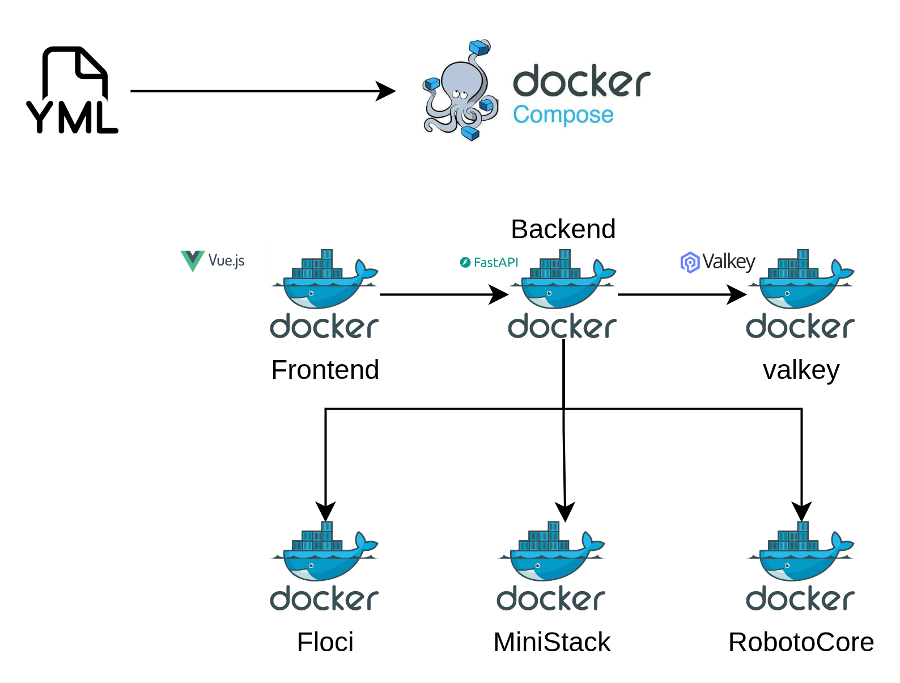

Cuando desarrollamos con el cloud y estamos en etapa de prototipado investigacion o para ambientes de prueba, el ciclo de feedback puede ser lento: desplegar, probar, ver el error, corregir, volver a desplegar. Los emuladores locales (en este caso para AWS) existen para romper ese ciclo — te permiten trabajar con Lambda, DynamoDB, SQS y decenas de servicios más sin tocar tu cuenta de AWS.

También, si estamos iniciando en el mundo de AWS, que es algo que consultan mucho, es importante tomar confianza y verificar el impacto de los elementos que trabajamos en AWS: servicios, permisos, gestión de código e infraestructura como código y claro el elefante en la habitacion los costos!.

Actualmente tenemos varios emuladores disponibles para AWS y seguramente nos sintamos más cómodos con uno u otro. También tenemos que tener en cuenta qué servicios soportan realmente, qué operaciones funcionan, y que la documentación oficial de cada herramienta no siempre refleja el estado real.

**lvstack** nació de esa necesidad: un dashboard que levanta todos los emuladores con un solo comando, permite cargar el estado de las funciones que están disponibles y te muestra exactamente qué está corriendo, qué servicios están disponibles y qué operaciones funcionan — con datos reales, no documentación.

📺 [Video demo](https://youtu.be/zzuqZFexiw4) | 💻 [GitHub](https://github.com/olcortesb/lvstack)

## 🛠️ Los emuladores

Hay tres emuladores gratuitos que lvstack soporta:

| Emulador | Imagen Docker | Puerto | Health endpoint | Servicios | Versión |
|----------|--------------|--------|-----------------|-----------|--------|
| MiniStack | `ministackorg/ministack:latest` | 4566 | `/_ministack/health` | 82 | 1.5.3 |
| Floci | `floci/floci:latest` | 4567 | `/_localstack/health` | 79 | 1.7.0 |
| RobotoCore | `jackdanger/robotocore:latest` | 4569 | `/_robotocore/health` | 157 | 2026.8.25 |

Los tres son gratuitos y están pensados para desarrollo local — puedes probar Lambda, DynamoDB, SQS, SNS, EventBridge, Step Functions y muchos más sin necesidad de una cuenta de AWS.

Los tres exponen una API compatible con AWS SDK — puedes usar boto3, AWS CLI o cualquier SDK apuntando a `http://localhost:{puerto}` con credenciales ficticias.

## 🚀 Quick Start

Como se trata de un desarrollo local, solo necesitariamos Docker:

```bash
git clone https://github.com/olcortesb/lvstack && cd lvstack
docker compose up -d
```

Eso es todo. El dashboard carga automáticamente los datos de probe desde el repositorio y los sirve de inmediato. Abre `http://localhost:3000` y verás el dashboard con todos los emuladores y sus servicios.

Al arrancar, el backend compara la versión de cada emulador con el cache. En los logs verás algo así:

```
[lvstack] ✅ MiniStack 1.5.3 — all services cached.
[lvstack] ✅ Floci 1.7.0 — all services cached.
[lvstack] ✅ RobotoCore 2026.8.25 — all services cached.
```

Si algún emulador tiene una versión nueva, el backend te avisa con el comando exacto para actualizar el probe:

```
[lvstack] ⚠️  Floci new version detected: 1.8.0
[lvstack]    12 service(s) not in cache. Run to update:
[lvstack]    python scripts/generate_probe_data.py --stack floci
[lvstack]    python scripts/load_valkey.py
```

## 🏗️ Arquitectura

El stack completo corre en Docker Compose:



El backend en FastAPI tiene tres responsabilidades:
1. Consultar el health endpoint de cada emulador para saber si está online
2. Servir los datos de probe desde Valkey (operaciones soportadas por servicio)
3. Listar buckets S3 reales del emulador vía boto3

## 🔬 El problema del probe

Saber que un emulador "soporta Lambda" no dice mucho. ¿Soporta `CreateFunction`? ¿`InvokeWithResponseStream`? ¿`PutProvisionedConcurrencyConfig`?

Para responder eso, lvstack hace un **probe real**: por cada servicio que el emulador declara en su health endpoint, crea un cliente boto3 apuntando al emulador y llama a cada operación con parámetros ficticios. La respuesta determina el estado:

- `supported` — la operación responde (aunque sea con un error de negocio como `ResourceNotFoundException`)
- `not_implemented` — el emulador devuelve HTTP 501 o el código `NotImplemented`
- `unknown` — no se pudo determinar

```python
def _probe_operation(client, op_name: str, required: list[str]) -> str:
    method = getattr(client, _to_snake(op_name), None)
    if method is None:
        return 'unknown'
    try:
        method(**_build_dummy_input(required))
        return 'supported'
    except ClientError as e:
        code = e.response.get('Error', {}).get('Code', '')
        status = e.response.get('ResponseMetadata', {}).get('HTTPStatusCode', 0)
        if status == 501 or code in ('NotImplemented', 'InternalFailure', 'UnsupportedOperation'):
            return 'not_implemented'
        return 'supported'
    except Exception as e:
        msg = str(e)
        if '501' in msg or 'NotImplemented' in msg:
            return 'not_implemented'
        return 'supported'
```

La lógica clave: un `ResourceNotFoundException` o `ValidationException` significa que la operación **existe** en el emulador — simplemente no encontró el recurso ficticio. Un 501 significa que la operación no está implementada.

Los parámetros requeridos se extraen directamente del modelo de servicio de botocore, sin mantener listas manuales:

```python
def _get_service_operations(service_name: str) -> list[dict]:
    bs = BotocoreSession()
    loader = bs.get_component('data_loader')
    model = loader.load_service_model(service_name, 'service-2')
    ops = []
    for op_name, op_data in model['operations'].items():
        input_shape = op_data.get('input', {}).get('shape', '')
        required = model['shapes'].get(input_shape, {}).get('required', []) if input_shape else []
        ops.append({'name': op_name, 'required': required})
    return ops
```

Esto garantiza que el probe siempre esté actualizado con la versión de boto3 instalada.

## ⚡ Cache con Valkey

Probar todas las operaciones de todos los servicios tarda varios minutos. Para que el dashboard sea instantáneo, los resultados se cachean en Valkey (Redis-compatible) con la clave:

```
probe:{stack_id}:{service_id}:{version}
```

Por ejemplo: `probe:ministack:lambda:1.5.3`

La versión forma parte de la clave, así que cuando un emulador se actualiza, el probe se regenera automáticamente para la nueva versión. Las versiones anteriores quedan en cache sin interferir.

El flujo normal es:

1. `docker compose up -d` — arranca todo y carga el cache automáticamente
2. El backend sirve los datos desde Valkey en ~1ms

Solo necesitas ejecutar los scripts manualmente cuando hay una nueva versión de algún emulador y quieres actualizar el probe:

```bash
pip install boto3 httpx redis
python3 scripts/generate_probe_data.py   # probe real, guarda en data/probes/
python3 scripts/load_valkey.py           # carga en Valkey
```

## 📊 Datos reales: qué soporta cada emulador

Versiones probadas: MiniStack 1.5.3, Floci 1.7.0, RobotoCore 2026.8.25.

### Cobertura general

| Emulador | Servicios con probe | Startup | Memoria idle | Imagen |
|----------|--------------------:|--------:|-------------:|-------:|
| MiniStack | 82 | 2,043ms | 32MB | 184MB |
| Floci | 79 | 527ms | 15MB | 351MB |
| RobotoCore | 157 | 3,047ms | 76MB | 492MB |

Floci destaca por ser el más ligero en arranque (~527ms) y memoria (~15MB), ideal si quieres algo rápido para iterar. RobotoCore tiene la mayor cobertura de servicios, incluyendo muchos servicios serverless como Step Functions, EventBridge Pipes, Kinesis y Firehose. Combina implementaciones nativas con moto (la librería de mock de AWS para Python), lo que explica el número alto.

### Lambda: los tres al 100%

Lambda es el servicio más usado en desarrollo serverless. Los tres emuladores lo soportan completamente:

| Emulador | Total ops | Soportadas | Not implemented |
|----------|----------:|-----------:|----------------:|
| MiniStack 1.5.3 | 85 | 85 | 0 |
| Floci 1.7.0 | 85 | 85 | 0 |
| RobotoCore 2026.8.25 | 85 | 85 | 0 |

Incluyendo operaciones recientes como `CheckpointDurableExecution`, `GetDurableExecution` y `InvokeWithResponseStream`.

### EC2: diferencias grandes

EC2 tiene 763 operaciones en el modelo actual. Aquí las diferencias son significativas:

| Emulador | Soportadas | Not implemented | Cobertura |
|----------|----------:|----------------:|----------:|
| Floci 1.7.0 | 254 | 500 | 33% |
| RobotoCore 2026.8.25 | 542 | 212 | 71% |

Si tu proyecto usa EC2 localmente, RobotoCore tiene el doble de cobertura.

### Cognito: cobertura parcial en todos

`cognito-idp` tiene 122 operaciones. Ningún emulador lo cubre al 100%:

| Emulador | Soportadas | Not implemented | Cobertura |
|----------|----------:|----------------:|----------:|
| Floci 1.7.0 | 73 | 49 | 60% |
| RobotoCore 2026.8.25 | 78 | 44 | 64% |

### RDS: RobotoCore gana por mucho

| Emulador | Soportadas | Not implemented | Cobertura |
|----------|----------:|----------------:|----------:|
| Floci 1.7.0 | 47 | 116 | 29% |
| RobotoCore 2026.8.25 | 161 | 2 | 98% |

Si necesitas RDS local, RobotoCore es prácticamente la única opción.

### Servicios exclusivos de RobotoCore

Algunos servicios solo están disponibles en RobotoCore: `sagemaker`, `stepfunctions`, `codecommit`, `codepipeline`, `datasync`, `dms`, `forecast`, `fsx`, `glacier`, `greengrass`, `ivs`, `macie2`, `managedblockchain`, `mediaconnect`, `medialive`, `mediapackage`, `mediastore`, `memorydb`, `opensearchserverless`, `personalize`, `pinpoint`, `polly`, `quicksight`, `rekognition`, `sagemaker-runtime`, `securityhub`, `shield`, `signer`, `support`, `swf`, `workspaces`, `xray`, entre otros.

## 🧪 Cómo usar los emuladores con boto3

Los tres emuladores son compatibles con el AWS SDK. Solo necesitas apuntar el `endpoint_url` y usar credenciales ficticias:

```python
import boto3

client = boto3.client(
    "lambda",
    endpoint_url="http://localhost:4566",  # MiniStack
    aws_access_key_id="test",
    aws_secret_access_key="test",
    region_name="us-east-1",
)

# Crear una función Lambda local
client.create_function(
    FunctionName="my-function",
    Runtime="python3.12",
    Role="arn:aws:iam::000000000000:role/test-role",
    Handler="handler.lambda_handler",
    Code={"ZipFile": zip_bytes},
)

# Invocarla
response = client.invoke(
    FunctionName="my-function",
    Payload=b'{"key": "value"}',
)
print(response["Payload"].read())
```

Para Floci (`:4567`) o RobotoCore (`:4569`), solo cambia el `endpoint_url`.

Con AWS CLI:

```bash
# Listar funciones Lambda en MiniStack
aws lambda list-functions \
  --endpoint-url http://localhost:4566 \
  --region us-east-1

# Crear tabla DynamoDB en RobotoCore
aws dynamodb create-table \
  --endpoint-url http://localhost:4569 \
  --table-name my-table \
  --attribute-definitions AttributeName=id,AttributeType=S \
  --key-schema AttributeName=id,KeyType=HASH \
  --billing-mode PAY_PER_REQUEST \
  --region us-east-1
```

## Arrancar un solo emulador

Si no necesitas los tres, hay compose files individuales:

```bash
# Solo MiniStack
docker compose -f docker-compose.ministack.yml up -d

# Solo Floci
docker compose -f docker-compose.floci.yml up -d

# Solo RobotoCore
docker compose -f docker-compose.robotocore.yml up -d
```

El dashboard detecta automáticamente cuáles están online (polling cada 5s).

## 📋 Conclusiones

lvstack intenta resolver un problema concreto: saber qué emulador usar para tu proyecto sin leer documentación desactualizada.

Los datos reales muestran que:

- **Para servicios serverless que saben es uno de los puntos que mas me interesan (Lambda, DynamoDB, SQS, SNS, EventBridge, Step Functions, S3)**: los tres emuladores funcionan bien. Elige el que prefieras.
- **Para EC2**: RobotoCore tiene 71% de cobertura vs 33% de Floci.
- **Para RDS**: RobotoCore es prácticamente el único con cobertura real (98%).
- **Para Cognito**: cobertura parcial en todos (~60-64%). Verifica las operaciones específicas que necesitas.
- **Para servicios de ML/media/analytics**: solo RobotoCore.

El probe a nivel de operación es lo que hace útil esta información. "Soporta Lambda" no dice nada — "soporta las 85 operaciones de Lambda incluyendo Durable Execution" sí.

## 🔗 Referencias

- [lvstack en GitHub](https://github.com/olcortesb/lvstack)
- [Video demo](https://youtu.be/zzuqZFexiw4)
- [MiniStack](https://ministack.org)
- [Floci](https://floci.dev)
- [RobotoCore](https://github.com/jackdanger/robotocore)
- [Valkey](https://valkey.io)
- [FastAPI](https://fastapi.tiangolo.com)
- [botocore service models](https://github.com/boto/botocore/tree/develop/botocore/data)

---

Gracias por leer, cualquier comentario recomendacion mejora bien venidos el codigo esta en mi github!

¡Saludos!

Oscar Cortés
