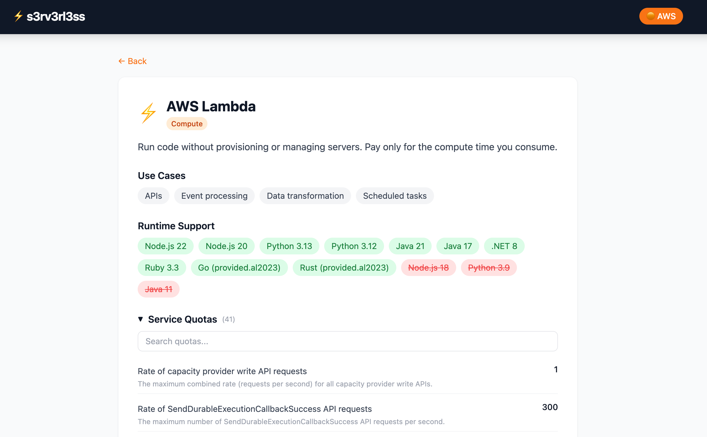
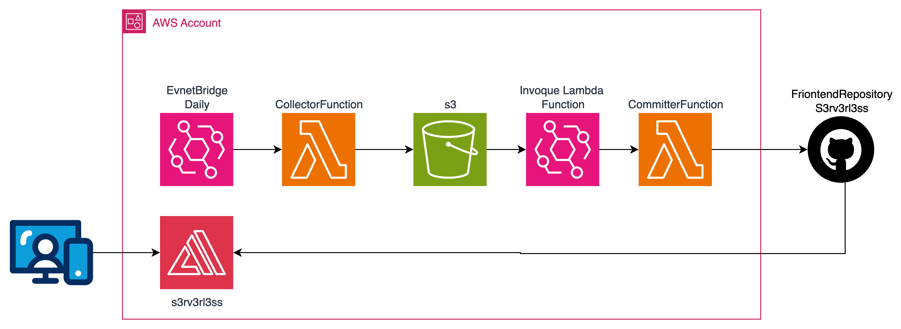

# s3rv3rl3ss: runtimes, noticias, límites y quotas de servicios serverless de AWS, actualizados diariamente

## Introducción

Quienes trabajamos con servicios serverless de AWS sabemos que hay una pregunta que aparece constantemente: ¿cuál es el límite de payload de API Gateway? ¿Cuántos GSIs puedo tener por tabla en DynamoDB? ¿Hasta cuándo tiene soporte el runtime de Node.js 18 en Lambda? ¿Cuánta memoria puedo asignar a una función?

La información existe, pero está dispersa entre documentación oficial, páginas de Service Quotas, changelogs y posts de "What's New". Cada vez que necesitaba un dato, terminaba abriendo tres o cuatro pestañas, navegando entre tablas y comparando versiones.

Después de repetir este proceso demasiadas veces, decidí construir una herramienta que centralizara toda esta información en un solo lugar, actualizada automáticamente todos los días. Así nació [s3rv3rl3ss](https://s3rv3rl3ss.olcortesb.com/).

## ¿Qué es s3rv3rl3ss?

Es una aplicación web que recopila y muestra en un solo lugar los **runtimes**, **límites**, **quotas**, **noticias** y **precios** de los principales servicios serverless de AWS. La información se actualiza diariamente de forma automática, sin intervención manual.

Actualmente cubre 15 servicios:

| Categoría | Servicios |
|-----------|-----------|
| Compute | Lambda, Fargate |
| Database | DynamoDB, Aurora Serverless |
| Integration | API Gateway, SQS, SNS, EventBridge, Step Functions, AppSync |
| Storage | S3 |
| Security | Cognito, Secrets Manager |
| Analytics | Kinesis Data Streams |
| AI/ML | Bedrock |

Para cada servicio se puede consultar:

- **Service Quotas**: obtenidas directamente de la API de AWS Service Quotas, con indicación de cuáles son ajustables
- **Límites estáticos**: los que no están en la API pero son importantes (tamaño de payload, timeouts, etc.)
- **Runtimes**: para Lambda, con fechas de fin de soporte y estado (activo/deprecado)
- **Noticias**: las últimas novedades del servicio desde el RSS de AWS What's New
- **Precios**: referencia rápida de pricing con link a la calculadora de AWS
- **Changelog**: historial de cambios detectados automáticamente (quotas que cambiaron, runtimes nuevos, etc.)

## Cómo la uso en mi día a día

La uso principalmente para tres cosas:

**Consulta rápida de límites**: cuando estoy diseñando una arquitectura y necesito validar si un enfoque es viable. Por ejemplo, si el payload de mi evento cabe en SQS (256 KB) o si necesito ir por S3 + referencia.

**Monitoreo de runtimes**: para saber cuándo un runtime de Lambda está próximo a deprecarse. La página muestra los runtimes con colores: verde (activo), amarillo (próximo a expirar) y rojo (deprecado). Esto me ha salvado más de una vez de enterarme tarde de una deprecación.

**Noticias filtradas**: en vez de revisar todo el feed de AWS What's New, veo solo las noticias relevantes para los servicios serverless que uso.

## La arquitectura del backend

El backend es, como no podía ser de otra manera, completamente serverless. Desplegado con AWS SAM:

1. **EventBridge** dispara la Lambda de recolección diariamente a las 6:00 UTC
2. **CollectorFunction** (Python 3.12) consulta las siguientes fuentes de datos:
   - [Service Quotas API](https://docs.aws.amazon.com/servicequotas/2019-06-24/apireference/API_ListServiceQuotas.html) — quotas actuales de cada servicio, con fallback a `list_aws_default_service_quotas` cuando el servicio no tiene quotas personalizadas
   - [AWS What's New RSS](https://aws.amazon.com/about-aws/whats-new/recent/feed/) — últimas 5 noticias por servicio, filtradas por keywords
   - [Documentación de runtimes de Lambda](https://docs.aws.amazon.com/lambda/latest/dg/lambda-runtimes.html) — scraping del markdown oficial, extrae nombre, identificador, estado y fecha de deprecación
   - **Límites estáticos** definidos en `services.py` — límites que no están disponibles en la API (timeouts, tamaños de payload, etc.)
   - **Precios** — resumen de pricing por servicio y detalles con precios unitarios (región US East), URLs a las páginas oficiales de pricing de cada servicio
3. El resultado se escribe como JSON en **S3**
4. El evento de S3 ObjectCreated llega a **EventBridge**, que dispara la **CommitterFunction**
5. **CommitterFunction** clona el repo del frontend, actualiza el archivo `services-aws.json`, hace commit y push
6. **AWS Amplify** detecta el push y despliega automáticamente el frontend

El resultado: cada mañana, la página tiene datos frescos sin que yo haga nada.

## El frontend

El frontend es una SPA construida con **Vue 3 + Vite + Tailwind CSS**, desplegada en **AWS Amplify**. Usa [Fuse.js](https://www.fusejs.io/) para búsqueda fuzzy dentro de las quotas y límites de cada servicio, lo cual es especialmente útil en servicios como Bedrock que tiene más de 1,100 quotas o API Gateway con más de 100.

## Agregar un servicio nuevo

Para agregar un servicio, solo hay que editar el archivo `services.py` en el backend, mover el servicio de `DISABLED_SERVICES` a `SERVICES`, hacer build y deploy. El pipeline se encarga del resto. De esta manera fuimos activando progresivamente los 15 servicios que tiene actualmente la página, validando que los datos se recopilaran correctamente antes de activar el siguiente.

## Consideraciones

- La Service Quotas API no cubre todos los límites de todos los servicios, por eso se complementa con límites estáticos definidos manualmente
- Los runtimes de Lambda se obtienen haciendo scraping de la documentación oficial en formato markdown, lo cual puede romperse si AWS cambia el formato
- El CommitterFunction necesita un token de GitHub con permisos de escritura, almacenado en Secrets Manager
- El frontend no tiene backend propio: todo el dato viene del JSON estático que genera el pipeline

## Referencias

- [s3rv3rl3ss (live)](https://s3rv3rl3ss.olcortesb.com/)
- [Frontend repo](https://github.com/olcortesb/s3rv3rl3ss)
- [Backend repo](https://github.com/olcortesb/s3rv3rl3ss-backend)
- [AWS Service Quotas API](https://docs.aws.amazon.com/servicequotas/2019-06-24/apireference/Welcome.html)
- [AWS What's New RSS](https://aws.amazon.com/about-aws/whats-new/recent/feed/)
- [Lambda Runtimes Documentation](https://docs.aws.amazon.com/lambda/latest/dg/lambda-runtimes.html)

---

Gracias por leer.

¡Saludos!

Oscar Cortés
