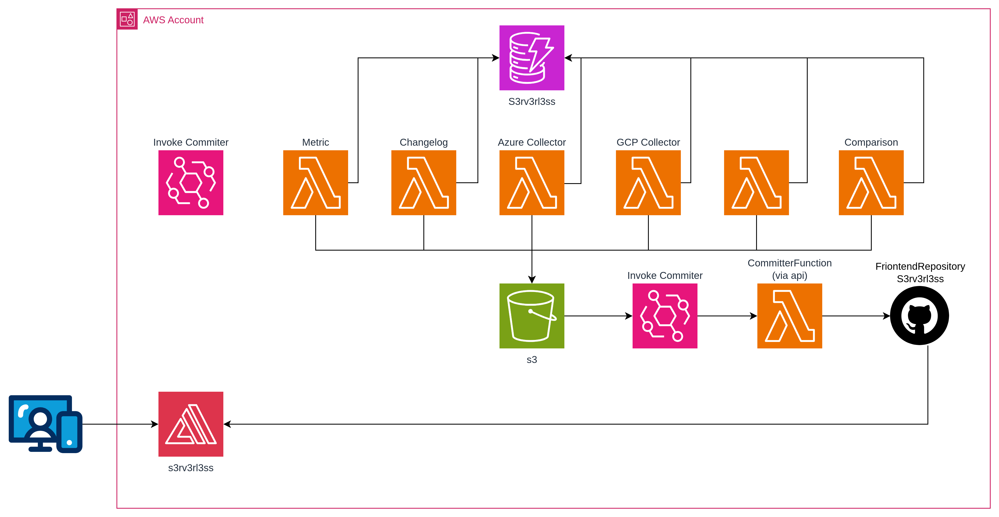

# s3rv3rl3ss ahora es multi-cloud: comparando serverless entre AWS, GCP y Azure


Hace unos dias empese aconstruír [s3rv3rl3ss](https://s3rv3rl3ss.olcortesb.com/), un dashboard que recopila quotas, límites, runtimes y noticias de servicios serverless de AWS, actualizado diariamente de forma automática. La pregunta natural era: ¿y los otros providers?

En esta actualización, el proyecto pasó de ser solo AWS a cubrir **3 providers** (AWS, GCP, Azure) con una vista de comparación lado a lado.

## Arquitectura actualizada



El pipeline ahora tiene 7 Lambdas ejecutándose diariamente con EventBridge Schedules escalonados:

| Hora (UTC) | Lambda | Función |
|---|---|---|
| 06:00 | AWS Collector | 22 servicios |
| 06:15 | GCP Collector | 18 servicios |
| 06:30 | Azure Collector | 17 servicios |
| 06:45 | Comparisons Generator | Cross-provider |
| 06:50 | Changelog Generator | Desde DynamoDB |
| 06:55 | Metrics Generator | CloudWatch + DynamoDB |

Cada collector escribe su JSON a S3. Un evento `S3 ObjectCreated` dispara via EventBridge la función **CommitterFunction** que commitea el archivo al repo del frontend usando la GitHub Contents API. Amplify detecta el push y auto-deploya.

## Fuentes de datos por provider

### AWS
- **Quotas**: Service Quotas API
- **Pricing**: AWS Price List API
- **News**: AWS What's New RSS + blog feeds
- **Runtimes**: Scraping de docs de Lambda (markdown)
- **Limits**: Scraping de docs por servicio

### GCP
- **News**: GCP Release Notes RSS (Atom, por servicio)
- **Limits/Pricing/Runtimes**: Datos estáticos con referencias a docs

### Azure
- **Pricing**: Azure Retail Prices API (pública, sin auth)
- **News**: Azure Blog RSS filtrado por keywords
- **Limits/Runtimes**: Datos estáticos con referencias a docs

## Eliminando la Git Layer

El cambio más interesante en el backend fue eliminar la Lambda Layer con git. Antes, el committer necesitaba un binario de git empaquetado como layer para hacer clone/commit/push. Ahora usa directamente la **GitHub Contents API**:

```python
def commit_file(token, repo_path, content, message):
    sha = get_file_sha(token, repo_path)
    encoded = base64.b64encode(content.encode("utf-8")).decode("utf-8")

    payload = {
        "message": message,
        "content": encoded,
        "branch": GITHUB_BRANCH,
        "committer": {
            "name": "s3rv3rl3ss-bot",
            "email": "s3rv3rl3ss-bot@automated.dev",
        },
    }
    if sha:
        payload["sha"] = sha

    github_api("PUT", f"contents/{repo_path}", token, payload)
```

Ventajas:
- Sin layer de git (~50MB menos en el deploy)
- Sin necesidad de clonar el repo completo
- Cada archivo se commitea individualmente cuando cambia
- Solo usa `urllib` de la stdlib (sin dependencias extra)

## Lambda de comparaciones

La nueva `ComparisonsFunction` lee los 3 JSONs de providers desde S3 y genera un `comparisons.json` con mapeos verificados entre servicios equivalentes:

```python
CATEGORIES = [
    {
        "id": "functions",
        "name": "Functions",
        "services": {"aws": "lambda", "gcp": "cloud-run-functions", "azure": "azure-functions"},
        "limits": [
            {"label": "Max timeout", "aws": "Function timeout", "gcp": "Max function timeout (2nd gen)", "azure": "Max execution time (Consumption)"},
            {"label": "Max memory", "aws": "Function memory allocation", "gcp": "Max memory", "azure": "Max memory (Consumption)"},
            ...
        ],
    },
    ...
]
```

Hay 13 categorías: Functions, Containers, Kubernetes, NoSQL, Queues, etc. Cada una mapea los field names específicos de cada provider para que el frontend pueda mostrarlos lado a lado.

## Frontend: vista de comparación

En el frontend (Vue 3), la nueva vista `/compare` permite seleccionar una categoría y ver limits y pricing de los 3 providers en una tabla:

```javascript
function getLimitValue(provider, row) {
  // Primero busca valor estático (para datos sin API)
  const staticVal = row[`${provider}_value`]
  if (staticVal) return staticVal

  // Luego busca en los datos dinámicos del servicio
  const fieldName = row[provider]
  const svc = getService(provider)
  const limit = svc.limits.find(l => l.name === fieldName)
  return limit?.value
}
```

El patrón de `static_value` permite mezclar datos de APIs reales (AWS Service Quotas, Azure Retail Prices) con datos estáticos donde no hay API pública disponible.

## Changelog con links

El changelog de cada servicio ahora incluye links directos a la fuente (AWS What's New, GCP Release Notes, Azure Blog). Así puedes ir directo al anuncio original sin buscar.

## DynamoDB para persistencia

Originalmente todo se escribía directo a S3 como JSON. Ahora los collectors también persisten en DynamoDB usando single-table design:

```python
# pk: "aws#lambda", sk: "CHANGE#2026-05-21#a3f2"
# pk: "aws#lambda", sk: "LIMIT#Function timeout"
# pk: "aws#lambda", sk: "NEWS#2026-05-21#b1c4"
# pk: "aws#lambda", sk: "RUNTIME#python3.12"
# pk: "aws#lambda", sk: "PRICING#Requests"
```

Con un GSI (`gsi1pk`/`gsi1sk`) se pueden hacer queries como "todos los cambios de AWS en los últimos 90 días" o "todos los runtimes de GCP".

Esto habilitó dos funciones nuevas:

- **ChangelogFunction**: Genera `changelog-{provider}.json` consultando los CHANGE items de DynamoDB. Ya no depende de comparar JSONs en S3.
- **MetricsFunction**: Consulta CloudWatch + DynamoDB para generar métricas reales del propio pipeline (invocaciones, duración, errores, costos estimados).

## Métricas del proyecto

La `MetricsFunction` es la que más me gusta. Consulta CloudWatch para obtener las métricas reales de todas las Lambdas del stack, DynamoDB para el conteo de items, y S3 para los objetos. Con eso calcula el costo mensual real:

```python
def lambda_handler(event, context):
    metrics_month = _get_lambda_metrics(STACK_PREFIX, month_start, now, 2592000)
    dynamo = _get_dynamo_metrics()  # describe_table → ItemCount, TableSizeBytes
    s3_metrics = _get_s3_metrics()  # list_objects_v2 → count
    cost = _calculate_cost(metrics_today, metrics_month)
```

El resultado se publica como `metrics.json` y el frontend lo muestra en `/metrics`: costo mensual (spoiler: ~$0.40, solo Secrets Manager sale del free tier), invocaciones por función, duración promedio, errores, items en DynamoDB y objetos en S3.

Es básicamente el proyecto monitoreándose a sí mismo.

## Resultado

El sitio cubre 57 servicios serverless (22 AWS + 18 GCP + 17 Azure) con comparaciones en 13 categorías (Functions, Kubernetes, Containers, NoSQL, Serverless SQL, Object Storage, Messaging, Events, API Gateway, Orchestration, Streaming, Secrets, AI/ML). Todo se actualiza diariamente sin intervención manual.

Live: [s3rv3rl3ss.olcortesb.com](https://s3rv3rl3ss.olcortesb.com/)

## Referencias

- [s3rv3rl3ss frontend](https://github.com/olcortesb/s3rv3rl3ss)
- [s3rv3rl3ss backend](https://github.com/olcortesb/s3rv3rl3ss-backend)
- [GitHub Contents API](https://docs.github.com/en/rest/repos/contents)
- [AWS Service Quotas API](https://docs.aws.amazon.com/servicequotas/2019-06-24/apireference/API_ListServiceQuotas.html)
- [Azure Retail Prices API](https://learn.microsoft.com/en-us/rest/api/cost-management/retail-prices/azure-retail-prices)
