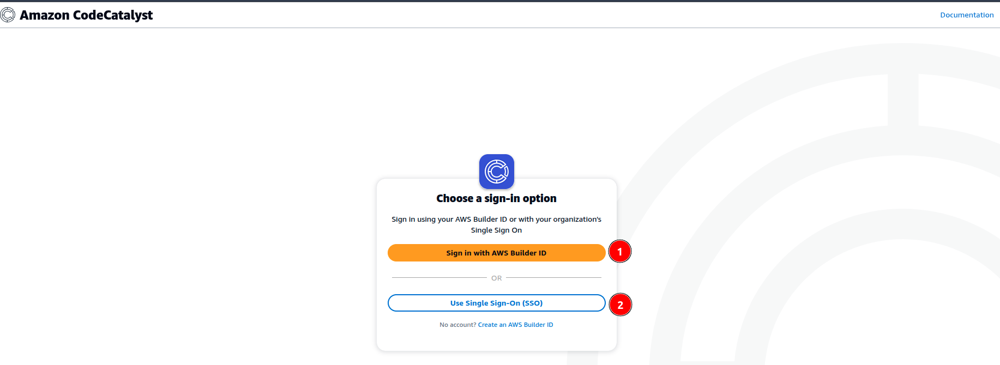
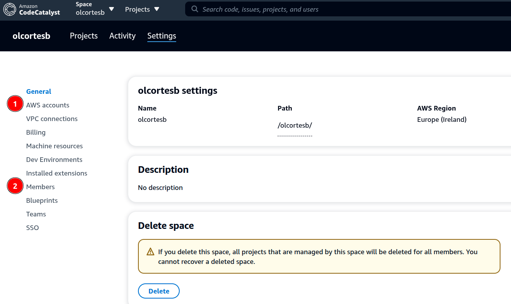
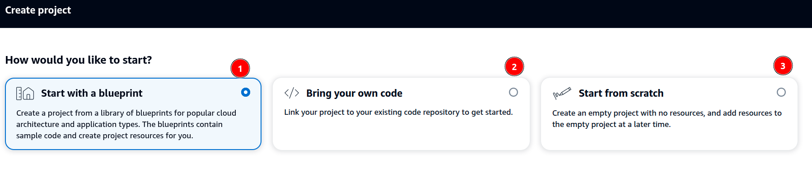
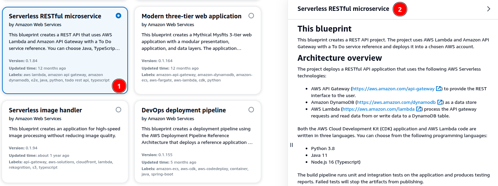
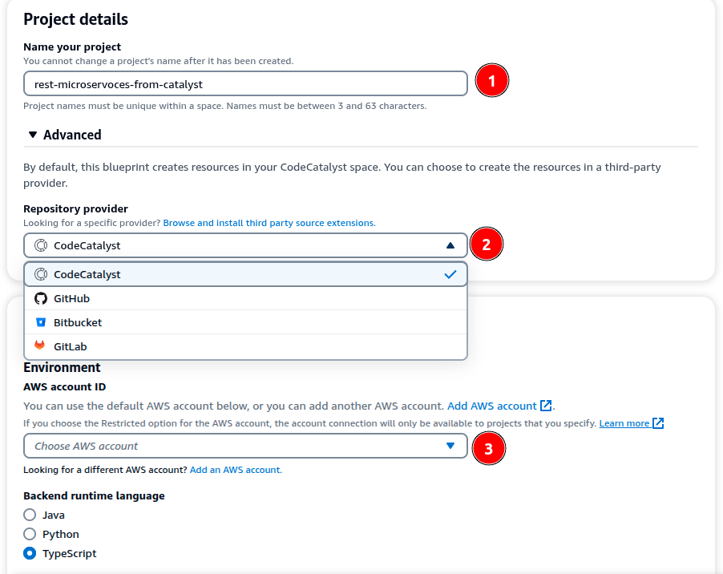
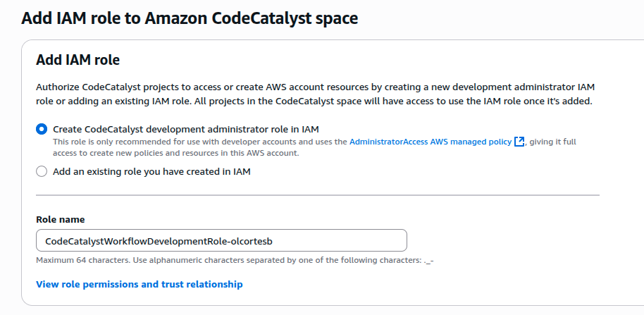
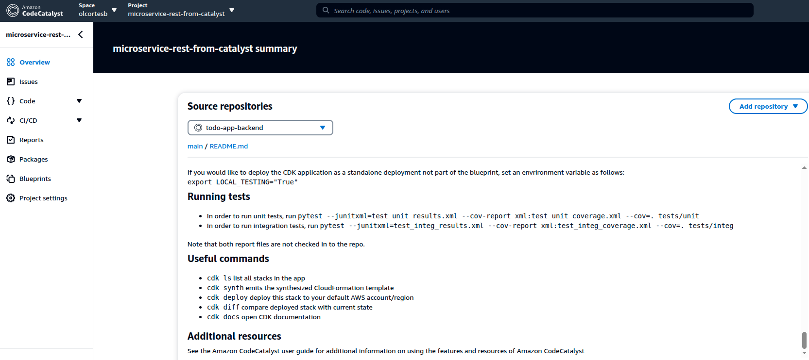
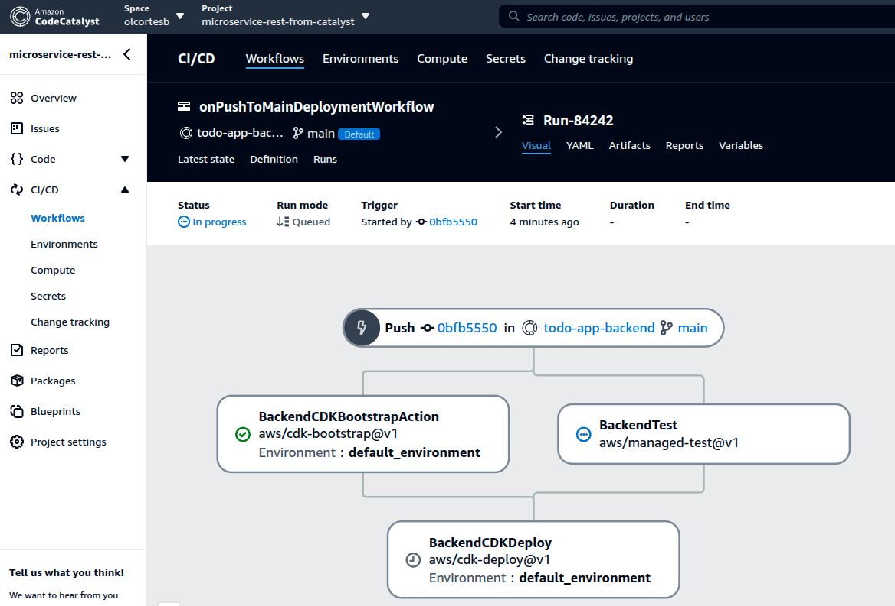
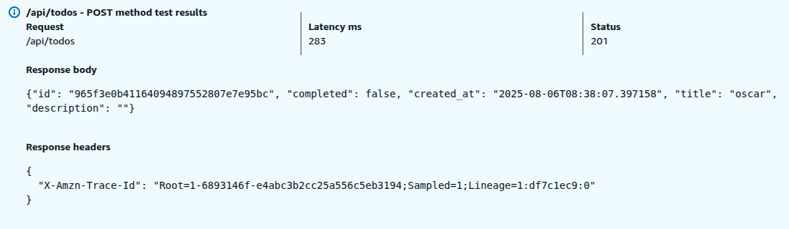
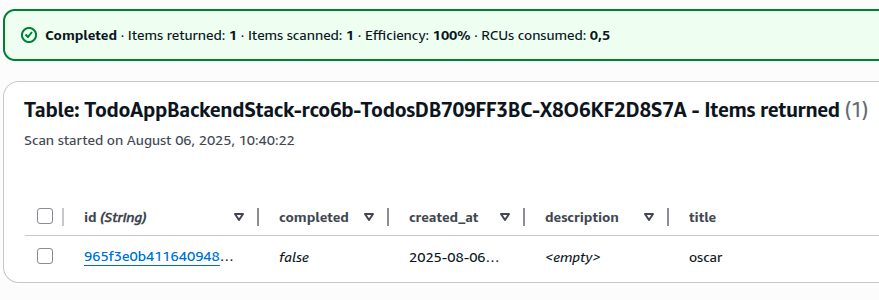

En este *post* mostraré cómo conectarse a *AWS CodeCatalyst* desde el ID de Builder, aprovechando la capa gratuita. Realizaremos algunas pruebas de las funcionalidades básicas y, en futuros *posts*, profundizaremos en las características avanzadas del servicio.

## 🚀 En primer lugar ¿Qué es AWS CodeCatalyst?

AWS CodeCatalyst es un servicio gestionado por AWS que unifica en una sola plataforma todas las etapas del desarrollo de software: planificación, codificación, pruebas, integración continua (CI), entrega continua (CD) y despliegue.

> [https://docs.aws.amazon.com/codecatalyst/latest/userguide/welcome.html](https://docs.aws.amazon.com/codecatalyst/latest/userguide/welcome.html)

## 👷 y ¿Qué es el AWS Builder ID?

AWS Builder ID es tu **identidad personal unificada** dentro del ecosistema de AWS. A diferencia de una cuenta de AWS, que está diseñada para acceder a servicios desde la consola o AWS cli, el Builder ID te permite iniciar sesión en herramientas de aprendizaje, desarrollo o colaboración como **Amazon Q Developer**, **CodeCatalyst**, entre otros.

> [https://docs.aws.amazon.com/signin/latest/userguide/sign-in-aws\_builder\_id.html](https://docs.aws.amazon.com/signin/latest/userguide/sign-in-aws_builder_id.html)
> 
> [https://docs.aws.amazon.com/signin/latest/userguide/differences-aws\_builder\_id.html](https://docs.aws.amazon.com/signin/latest/userguide/differences-aws_builder_id.html)

## Conectándonos a CodeCatalyst

Accediendo a la *URL* de CodeCatalyst nos da las opciones de conectarnos por Builder ID (1) o SSO (2), ya podemos observar que es un servicio con inicio de sesión y acceso fuera de la consola tradicional de AWS.

Luego de seleccionar el ID, si es la primera vez que entramos nos solicitará un nombre de espacio de trabajo, región y la cuenta a la que queremos asociar los recursos y servicios que vamos a desplegar, así como el costo.

Configurados estos elementos pasamos a la pantalla principal de administración del servicio, donde podemos gestionar las cuentas sobre las que actuaremos (1) y los miembros de este espacio de trabajo (2) entre otras configuraciones.

# Creación de un nuevo proyecto

Bien, ahora vamos a crear un proyecto desde un Blueprint y a desplegar la aplicación. Tenemos tres opciones para crear un proyecto, vamos a utilizar la opción desde Blueprint (1) para este post.

Al seleccionar Blueprint se despliegan una serie de Blueprints configurados que al elegir alguno (1) nos dará detalles de los servicios que usa, arquitectura y permisos necesarios (2).

En el siguiente paso podemos seleccionar el nombre del proyecto (1), dónde vamos a almacenar el código (2) que me parece una funcionalidad interesante para equipos que no quieren gestionar su código desde CodeCatalyst, y la cuenta donde vamos a desplegar el servicio (3).

Importante para poder acceder a la cuenta realizar una aprobación en la cuenta destino.

Y también nos pedirá agregar un rol desde la cuenta:

💡

Importante es necesario agregar una cuenta donde facturar aunque estemos usando el free tier

Y finalmente creamos el proyecto, elegimos Python, pero podemos elegir la herramienta de IaC (Infrastructure as Code) que en este caso es **CDK**

Con un “Run” en la sección CI/CD ejecutamos el pipeline que tiene el Blueprint

Y probando la **API** validamos que funciona correctamente:

Y en la DynamoDB …

## Conclusiones y comentarios

### Historia

* **Diciembre de 2022**: AWS presentó CodeCatalyst en versión *preview* durante el congreso **re:Invent 2022**, anunciándose como una herramienta todo en uno para flujo DevOps en AWS
    
* > [announcing-amazon-codecatalyst-preview-a-unified-software-development-service](https://aws.amazon.com/blogs/aws/announcing-amazon-codecatalyst-preview-a-unified-software-development-service)
    
* **20 de abril de 2023**: CodeCatalyst alcanzó la **disponibilidad general (GA)**. Desde entonces, soporta workflows con AWS Graviton, integración de repositorios GitHub o GitLab, gestión de issues vinculadas a pull requests y mucho más
    
    > [general-availability-amazon-codecatalyst](https://aws.amazon.com/about-aws/whats-new/2023/04/general-availability-amazon-codecatalyst/)
    

### Actualidad

* En **julio de 2025**, se lanzó la imagen universal `Universal image 5.0`.
    
    > [https://docs.aws.amazon.com/codecatalyst/latest/userguide/doc-history.html](https://docs.aws.amazon.com/codecatalyst/latest/userguide/doc-history.html)
    
* También se añadieron mejoras en temas de **privacidad de datos**, roles, y eliminación de Blueprints obsoletos.
    
    > [Documentación de AWS](https://docs.aws.amazon.com/codecatalyst/latest/userguide/doc-history.html)
    

### Conclusiones

* Hemos conectado AWS CodeCatalyst a través del **Builder ID**, conectando una cuenta de destino y desplegando un Blueprint correctamente.
    
* Es un servicio integral que permite centralizar todos los servicios que un equipo de desarrollo necesita para gestionar el ciclo de vida de las aplicaciones en AWS.
    
* Hay mucho camino para probar y desarrollar utilizando las features que CodeCatalyst tiene para ofrecer.
    

Gracias por leer, Saludos…